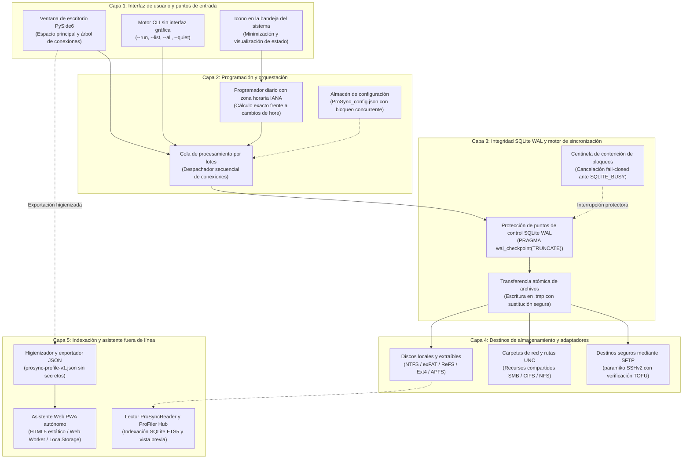
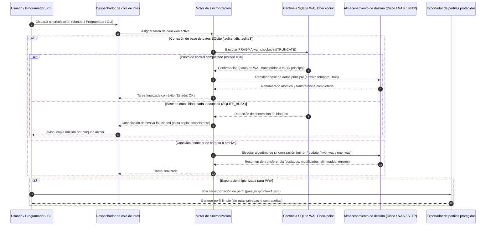
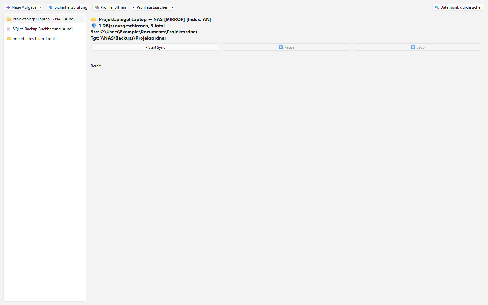
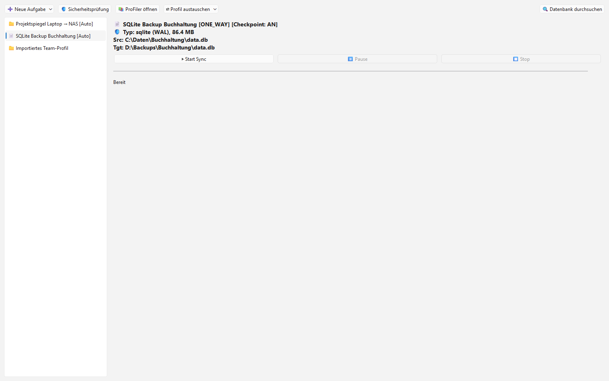
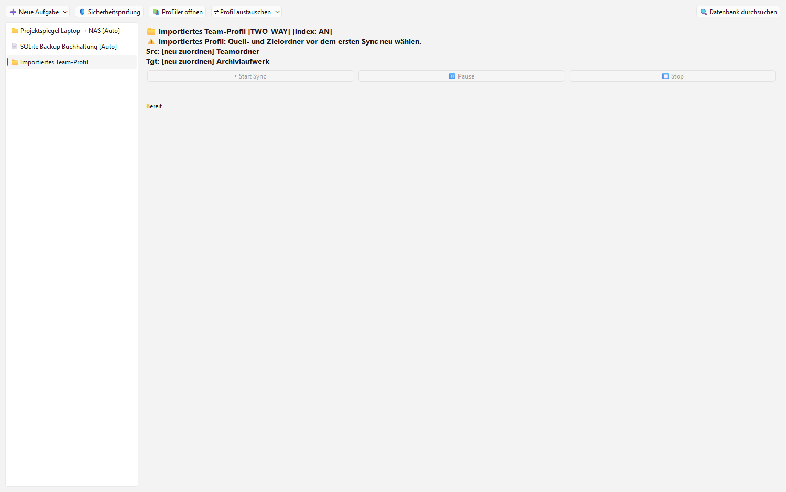

# ProSync

[English](README.md) · [Deutsch](README_de.md) · [Español](README.es.md) · [Guía del usuario](USER_GUIDE.md)

> Sincronización inteligente de copias de seguridad locales con protección automatizada de bases de datos SQLite en modo WAL.

[](LICENSE)
[](NOTICE)
[](CHANGELOG.md)
[](#10-installation--dependencies)
[](pyproject.toml)
[](#16-testing--quality-checks)
[](PRIVACY_POLICY.md)
[](SECURITY.md)
[](SECURITY.md)
[](THIRD_PARTY_LICENSES.md)
[](https://github.com/file-bricks)
[](https://github.com/open-bricks)
[](llms.txt)
[](CHANGELOG.md)

> [!NOTE]
> **Aclaración y desambiguación:** `file-bricks/ProSync` es una aplicación de escritorio y segundo plano de código abierto basada en Python (PySide6) para la sincronización de archivos y carpetas locales con protección automatizada para bases de datos SQLite en modo WAL. Este proyecto no está asociado con software empresarial de replicación de bases de datos ni con utilidades homónimas de terceros para macOS.

**Índice para modelos de lenguaje (LLM):** Especificación disponible en [`llms.txt`](llms.txt). Última revisión: **2026-09-26**.

---

## Navegación rápida

1. [Funcionalidades y capacidades principales](#1-features)
2. [Arquitectura del sistema y flujo de datos](#2-architecture)
3. [Perfiles de usuario objetivo y visibilidad](#3-target-personas--discoverability)
4. [Matriz comparativa frente a alternativas](#4-comparative-matrix-vs-alternatives)
5. [Diagramas Mermaid duales](#5-dual-mermaid-diagrams)
6. [Gobernanza e invariantes de tiempo de ejecución](#6-governance--runtime-invariants)
7. [Modos de sincronización y semántica](#7-synchronization-modes)
8. [Protección de bases de datos SQLite WAL](#8-sqlite-wal-database-protection)
9. [Galería visual de funcionalidades](#9-visual-showcase--feature-gallery)
10. [Instalación y dependencias](#10-installation--dependencies)
11. [CLI y automatización sin interfaz gráfica](#11-cli--headless-automation)
12. [Copias de seguridad programadas y zonas horarias IANA](#12-scheduled-backups--iana-timezones)
13. [Acompañante web/PWA portable](#13-portable-webpwa-companion)
14. [ProSyncReader y búsqueda con ProFiler](#14-prosyncreader--profiler-search)
15. [Preparación para Windows Store y paquetes MSIX](#15-windows-store--msix-staging)
16. [Pruebas y aseguramiento de la calidad](#16-testing--quality-checks)
17. [Licencias de terceros y transparencia](#17-third-party-licenses--transparency)
18. [Política de seguridad y ecosistema de proyectos hermanos](#18-security-policy--sibling-ecosystem)

---

<a id="1-features"></a>
<a id="features"></a>
<a id="key-features"></a>
<a id="1-funciones"></a>
<a id="funciones"></a>
<a id="caracteristicas"></a>
## 1. Features & Core Capabilities

- **Sincronización de carpetas:** Modos flexibles unidireccionales, bidireccionales, de actualización, espejo y de solo índice.
- **Sincronización dedicada de archivos:** Conexiones exclusivas para archivos críticos individuales.
- **Detección automática de bases de datos:** Identifica proactivamente bases de datos SQLite (`.db`, `.sqlite`, `.sqlite3`, `.db3`) y MS Access.
- **Protección WAL Checkpoint Guard:** Ejecuta de forma segura `PRAGMA wal_checkpoint(TRUNCATE)` antes de copiar bases de datos activas, cancelando la operación de modo seguro (*fail-closed*) ante contención de bloqueos (`SQLITE_BUSY`) para evitar copias corruptas.
- **Integración en la bandeja del sistema (System Tray):** Ejecución en segundo plano sin distracciones en Windows, con soporte de inicio automático y menú contextual.
- **Programación flexible de tareas:** Temporizadores de intervalo configurables o ejecución diaria a horas específicas basadas en zonas horarias de la IANA con resistencia al cambio de hora estacional (DST).
- **Cola de sincronización por lotes (Batch Sync):** Selección y ejecución coordinada de múltiples tareas con retroalimentación detallada del progreso.
- **Operaciones atómicas sobre archivos:** Escritura en archivos temporales (`.tmp`) previa al reemplazo atómico, evitando estados parciales o inconsistentes ante cortes eléctricos.
- **Indexación y asistente ProFiler Companion:** Indexación opcional de texto completo y búsqueda instantánea mediante el lector complementario ProSyncReader.
- **Acompañante Web/PWA portable:** Exportación higienizada en formato `prosync-profile-v1.json` para inspección segura fuera de línea en dispositivos móviles y navegadores.
- **Preparación multiplataforma:** Pruebas estandarizadas de verificación de 8 puntos en entornos Linux y macOS.
- **Preparado para Windows Store:** Empaquetado MSIX completo, manifiestos AppxManifest e iconos conformes con la directiva 10.1.3.

---

<a id="2-architecture"></a>
<a id="architecture"></a>
<a id="architecture--data-flow"></a>
<a id="2-arquitectura"></a>
<a id="arquitectura"></a>
<a id="arquitectura--flujo-de-datos"></a>
## 2. System Architecture & Data Flow

ProSync estructura la interacción del usuario, la programación de tareas, la verificación de integridad y el almacenamiento en capas modulares y desacopladas:

```
+---------------------------------------------------------------------------------+
|                                 USER INTERFACE                                  |
|   +------------------------------------+   +--------------------------------+   |
|   | PySide6 Desktop GUI (Main Window)  |   | System Tray Background Monitor |   |
|   +------------------------------------+   +--------------------------------+   |
|   +------------------------------------+   +--------------------------------+   |
|   | Headless CLI (--run / --all)       |   | ProSyncReader Search Companion |   |
|   +------------------------------------+   +--------------------------------+   |
+---------------------------------------------------------------------------------+
                                         |
                                         v
+---------------------------------------------------------------------------------+
|                           SCHEDULER & BATCH ENGINE                              |
|   ├── IANA Timezone Evaluator (DST Safe)   ├── Batch Sync Execution Queue       |
|   └── Configuration Manager                └── Instance Lock Coordinator        |
+---------------------------------------------------------------------------------+
                                         |
                                         v
+---------------------------------------------------------------------------------+
|                        SYNC & INTEGRITY ENGINE (CORE)                           |
|   ├── SQLite WAL Checkpoint Guard (PRAGMA wal_checkpoint(TRUNCATE))             |
|   ├── Lock Contention Sentinel (SQLITE_BUSY Fail-Closed Abort)                  |
|   ├── Atomic Staging & Temporary File Copier (.tmp Safe Replace)                |
|   └── Mode Logic: mirror | update | two_way | one_way | index_only              |
+---------------------------------------------------------------------------------+
                                         |
                                         v
+---------------------------------------------------------------------------------+
|                              STORAGE DESTINATIONS                               |
|   ├── Local Drives (NTFS, exFAT, APFS, Ext4)                                    |
|   ├── Network Attached Storage (NAS / SMB / CIFS UNC paths)                     |
|   └── SFTP Remote Endpoints (Hardened Paramiko with Host Key TOFU)              |
+---------------------------------------------------------------------------------+
```

---

<a id="3-target-personas--discoverability"></a>
<a id="target-personas--discoverability"></a>
<a id="target-personas"></a>
<a id="3-perfiles-de-usuario"></a>
<a id="perfiles-de-usuario"></a>
## 3. Target Personas & Discoverability

### Perfiles de usuario objetivo

- **[PERSONA-01] Usuarios avanzados y administradores de sistemas Windows:**
  - *Contexto:* Automatización de copias de seguridad de directorios de trabajo esenciales, recursos compartidos en red (NAS) y unidades externas USB/NVMe.
  - *Dificultad recurrente:* Las herramientas estándar carecen de una adecuada integración en la bandeja del sistema, sufren de programaciones frágiles o corrompen bases de datos abiertas durante la copia.
  - *Solución de ProSync:* Ejecución silenciosa en segundo plano, disparadores diarios con soporte para zonas IANA, colas de procesamiento por lotes y sincronización atómica y protegida contra fallos.

- **[PERSONA-02] Desarrolladores de aplicaciones y bases de datos SQLite:**
  - *Contexto:* Entornos de escritorio y desarrollo que emplean SQLite en modo WAL (*Write-Ahead Logging*).
  - *Dificultad recurrente:* Los métodos convencionales de copia transfieren archivos mientras existen transacciones pendientes en el registro WAL, produciendo copias corruptas o inutilizables.
  - *Solución de ProSync:* Ejecución preventiva de puntos de control (`PRAGMA wal_checkpoint(TRUNCATE)`), detección de bloqueos defensiva (*fail-closed* ante `SQLITE_BUSY`) y exclusión selectiva de archivos auxiliares (`.db-wal`, `.db-shm`).

- **[PERSONA-03] Oficiales de privacidad, cumplimiento normativo y auditores de seguridad:**
  - *Contexto:* Sectores regulados, despachos legales, centros sanitarios y archivos locales confidenciales sujetos al RGPD.
  - *Dificultad recurrente:* Los clientes de almacenamiento en la nube recopilan telemetría, metadatos y estadísticas de uso en servidores externos.
  - *Solución de ProSync:* Arquitectura estrictamente *Local-First* con garantía de cero fuga de datos (*Zero-Egress*); ausencia absoluta de conectores de telemetría y ejecución en modo usuario sin privilegios (`RunAsInvoker`).

- **[PERSONA-04] Ingenieros de automatización y arquitectos de agentes de software:**
  - *Contexto:* Tareas desatendidas, tuberías de integración continua (CI), scripts por lotes y flujos asistidos por modelos de lenguaje.
  - *Dificultad recurrente:* Aplicaciones que solo funcionan mediante clics de ratón o interfaces gráficas que no pueden invocarse mediante scripts.
  - *Solución de ProSync:* Interfaz de línea de comandos completa (`--list`, `--run <id|nombre>`, `--all`, `--quiet`), exportación higienizada para acompañantes (`prosync-profile-v1.json`) y suites de pruebas automatizadas rigurosas.

### Términos de búsqueda de alta intención

- *"python desktop backup synchronization tool"*
- *"pyside6 file sync folder backup windows tray"*
- *"sqlite wal database safe backup python"*
- *"local-first file synchronization zero egress"*
- *"offline two-way folder sync python"*
- *"sqlite wal checkpoint backup automation"*
- *"scheduled folder backup iana timezone python"*
- *"sftp atomic upload backup desktop app"*
- *"windows store msix backup sync utility"*
- *"open source backup sync tool mit license"*

---

<a id="4-comparative-matrix-vs-alternatives"></a>
<a id="comparative-matrix-vs-alternatives"></a>
<a id="comparative-matrix"></a>
<a id="4-matriz-comparativa"></a>
<a id="matriz-comparativa"></a>
## 4. Comparative Matrix vs. Alternatives

| Dimensión técnica / Invariante | ProSync (`file-bricks`) | FreeFileSync | Robocopy / Rsync | Syncthing | Soluciones SaaS comerciales |
|---|---|---|---|---|---|
| **INV-LOCAL-01 Local-First & Zero Egress** | **100% Local y desconectado** | 100% Local | 100% Local | Protocolo de red P2P | Servidores en la nube / Telemetría |
| **INV-RUNAS-02 RunAsInvoker User Mode** | **Estrictamente sin privilegios** | Instalador nativo | Integrado en el SO | Usuario / Demonio | Servicio de sistema / Elevación UAC |
| **INV-WAL-03 SQLite WAL Checkpoint Guard** | **Automatizado `PRAGMA wal_checkpoint`** | Ninguno (Copia simple) | Ninguno (Copia simple) | Ninguno (Monitor de archivos) | Ninguno (Error de archivo bloqueado) |
| **INV-INTEG-04 Atomic Staging & Replacement** | **Reemplazo seguro con `.tmp`** | Flujo directo | Flujo directo | Preparación temporal | Carga por fragmentos |
| **INV-SCHED-05 DST-Aware IANA Scheduling** | **Motor de zona horaria IANA integrado** | Programador de tareas | Programador / Cron | Monitor continuo | Planificación remota |
| **INV-PWA-06 Redacted Offline Companion** | **Exportación `prosync-profile-v1.json`** | Ninguno | Ninguno | Interfaz web (Localhost) | Panel web en la nube |
| **INV-PLAT-07 Cross-Platform Smoke Parity** | **Matriz Windows, Linux y macOS** | Windows, macOS, Linux | Específico del SO | Multiplataforma en Go | Aplicaciones nativas dispares |
| **INV-STORE-08 Windows Store / MSIX Staging** | **AppxManifest y directiva 10.1.3** | Instalador independiente | Ninguno | Chocolatey / Scoop | Tienda de Windows |
| **INV-DOCS-09 1:1 Bilingual Docs & LLM Index** | **Documentación integral + `llms.txt`** | Documentación en inglés | Páginas man / Docs | Documentación en inglés | Centro de ayuda online |
| **INV-SLA-10 Open Source Governance & SLA** | **Licencia MIT, SLA de respuesta de 48h** | GPL v3 | Propietario / GPL | MPL 2.0 | Propietario comercial |

---

<a id="5-dual-mermaid-diagrams"></a>
<a id="dual-mermaid-diagrams"></a>
<a id="mermaid-diagrams"></a>
<a id="end-to-end-backup--wal-checkpoint-lifecycle"></a>
<a id="5-diagramas-mermaid-duales"></a>
<a id="diagramas-mermaid-duales"></a>
## 5. Dual Mermaid Diagrams

### Topología arquitectónica del sistema (`flowchart TD`)



### Ciclo de vida de la copia de seguridad y puntos de control WAL (`sequenceDiagram`)



---

<a id="6-governance--runtime-invariants"></a>
<a id="governance--runtime-invariants"></a>
<a id="runtime-invariants"></a>
<a id="6-gobernanza--invariantes"></a>
<a id="gobernanza--invariantes"></a>
## 6. Governance & Runtime Invariants

ProSync garantiza diez invariantes esenciales de tiempo de ejecución y gobernanza:

| Invariante | Título | Implementación y verificación |
|---|---|---|
| `INV-LOCAL-01` | **Local-First & Zero Egress** | Ejecución puramente local. Cero conexiones de red hacia destinos de análisis, seguimiento o telemetría. Verificado en `tests/test_security_license_contract.py`. |
| `INV-RUNAS-02` | **Unprivileged RunAsInvoker** | Opera estrictamente en espacio de usuario sin privilegios. Jamás requiere elevación UAC ni credenciales de administrador. Documentado en `SECURITY.md` y `pyproject.toml`. |
| `INV-WAL-03` | **SQLite WAL Crash Safety** | Emisión automática de `PRAGMA wal_checkpoint(TRUNCATE)` antes de copiar bases de datos activas; interrupción segura (*fail-closed*) ante bloqueos (`SQLITE_BUSY`). |
| `INV-INTEG-04` | **Atomic File Copy Staging** | La escritura se realiza en archivos temporales `.tmp` antes de la sustitución atómica definitiva, impidiendo que el destino quede en un estado corrupto ante interrupciones imprevistas. |
| `INV-SCHED-05` | **DST-Aware Daily Scheduling** | El motor de programación horaria con soporte IANA calcula la hora local exacta, evitando adelantos o ejecuciones descontroladas durante los cambios de horario estacional. |
| `INV-PWA-06` | **Redacted Companion Export** | El archivo exportado `prosync-profile-v1.json` elimina rutas absolutas confidenciales, credenciales de servidor y tokens de acceso para un uso seguro fuera de línea. |
| `INV-PLAT-07` | **Cross-Platform Smoke Parity** | Suites de prueba de 8 puntos para entornos Linux y macOS verifican la seguridad de rutas POSIX, comandos de apertura y el ciclo de vida de la interfaz en modo desatendido. |
| `INV-STORE-08` | **Windows Store & MSIX Staging** | Manifiesto AppxManifest verificado (`Geiger.ProSync`), términos de búsqueda conformes a la directiva 10.1.3 y conjunto completo de iconos para losetas de Windows. |
| `INV-DOCS-09` | **1:1 Bilingual Documentation** | Correspondencia estricta en estructura y anclajes entre las versiones en inglés (`README.md`), alemán (`README_de.md`) y español (`README.es.md`), sincronizadas con `llms.txt`. |
| `INV-SLA-10` | **Open Source Governance & SLA** | Licencia permisiva MIT, gestión pública de incidencias y compromiso formal de respuesta en 48 horas y triaje en 5 días hábiles según `SECURITY.md`. |

---

<a id="7-synchronization-modes"></a>
<a id="synchronization-modes"></a>
<a id="sync-modes"></a>
<a id="7-modos-de-sincronizacion"></a>
<a id="modos-de-sincronizacion"></a>
## 7. Synchronization Modes & Semantics

ProSync ofrece cinco modos de sincronización deterministas adaptados a diferentes necesidades operativas:

| Modo | Semántica de sincronización | Escenario principal de uso |
|---|---|---|
| **`mirror`** | Mantiene el destino como una réplica exacta del origen (eliminando archivos huérfanos en destino) | Copias maestras y respaldos completos |
| **`update`** | Copia únicamente los archivos más recientes y los ausentes (sin borrar nada en destino) | Respaldos incrementales diarios |
| **`two_way`** | Sincronización bidireccional resolviendo discrepancias según la marca temporal más reciente | Sincronización activa entre dos equipos |
| **`one_way`** | Copia desde el origen al destino sin eliminar jamás archivos existentes en el destino | Archivos seguros no destructivos |
| **`index_only`** | Indexa metadatos y la estructura de directorios sin transferir el contenido | Preparación para búsquedas rápidas con ProFiler |

---

<a id="8-sqlite-wal-database-protection"></a>
<a id="sqlite-wal-database-protection"></a>
<a id="database-protection-v32"></a>
<a id="database-safety"></a>
<a id="8-proteccion-sqlite-wal"></a>
<a id="proteccion-sqlite-wal"></a>
## 8. SQLite WAL Database Protection

ProSync supervisa de forma activa los archivos de base de datos SQLite y garantiza su consistencia durante las copias:

### Extensiones de base de datos reconocidas
- **SQLite:** `.sqlite`, `.sqlite3`, `.db`, `.db3`
- **MS Access:** `.mdb`, `.accdb`

### Reglas de protección aplicadas
1. **Exclusión automática en sincronización de carpetas:** Al sincronizar directorios con bases de datos vivas, los archivos auxiliares del diario WAL (`.db-wal`, `.db-shm`, `.db-journal`) se omiten automáticamente para impedir estados incongruentes en el destino.
2. **Conexiones dedicadas de archivo:** Para bases de datos en producción, se recomienda configurar una **Conexión de Archivo** con la opción de punto de control WAL activada.
3. **Punto de control preventivo:** Antes de transferir los datos, ProSync ejecuta la instrucción `PRAGMA wal_checkpoint(TRUNCATE)`:
   - **Éxito (código 0):** Los datos del diario WAL se consolidan íntegramente en la base de datos principal, la cual se copia de manera atómica.
   - **Contención o bloqueo:** Si otro proceso mantiene un bloqueo de escritura activo, ProSync suspende de inmediato la copia y registra `SQLITE_BUSY`, evitando generar una instantánea parcial o corrupta.

---

<a id="9-visual-showcase--feature-gallery"></a>
<a id="visual-showcase--feature-gallery"></a>
<a id="visual-showcase"></a>
<a id="9-galeria-visual"></a>
<a id="galeria-visual"></a>
## 9. Visual Showcase & Feature Gallery

| Panel principal y gestor de conexiones | Seguridad para bases de datos SQLite | Perfiles portables y visor Web PWA |
| :---: | :---: | :---: |
|  |  |  |
| *Gestión de múltiples tareas de sincronización con temporizadores y cola por lotes.* | *Detección de bases de datos SQLite WAL y punto de control antes de la copia.* | *Exportación higienizada de configuraciones para inspección fuera de línea.* |

---

<a id="10-installation--dependencies"></a>
<a id="installation--dependencies"></a>
<a id="installation"></a>
<a id="10-instalacion--dependencias"></a>
<a id="instalacion--dependencias"></a>
## 10. Installation & Dependencies

ProSync es compatible con Python 3.10, 3.11 y 3.12 (`>=3.10`).

```bash
pip install -r requirements.txt
```

### Dependencias principales de ejecución
- `PySide6 >= 6.5.0` (Interfaz gráfica de usuario e integración en la bandeja del sistema)
- `paramiko >= 3.4.0` (Transporte seguro de red SFTP)
- `tzdata >= 2025.2` (Base de datos de zonas horarias de la IANA para Windows)
- `pypdf >= 4.0.0` (Vista previa de documentos PDF en ProSyncReader)
- `(Opcional) python-docx` (Vista previa de búsqueda en documentos Word)

---

<a id="11-cli--headless-automation"></a>
<a id="cli--headless-automation"></a>
<a id="headless-cli"></a>
<a id="usage"></a>
<a id="11-cli--automatizacion-sin-interfaz"></a>
<a id="cli--automatizacion-sin-interfaz"></a>
## 11. CLI & Headless Automation

ProSync ofrece una interfaz completa de línea de comandos para scripts automatizados y servidores sin entorno gráfico:

```bash
# Enumerar todas las conexiones configuradas y su estado
python ProSyncStart_V3.1.py --list

# Ejecutar una conexión específica mediante su identificador o nombre
python ProSyncStart_V3.1.py --run "Daily Project Mirror"

# Ejecutar secuencialmente todas las conexiones habilitadas
python ProSyncStart_V3.1.py --all

# Modo silencioso para entornos de automatización desatendida
python ProSyncStart_V3.1.py --all --quiet --config path/to/config.json
```

---

<a id="12-scheduled-backups--iana-timezones"></a>
<a id="scheduled-backups--iana-timezones"></a>
<a id="scheduled-backups"></a>
<a id="12-copias-programadas--zonas-iana"></a>
<a id="copias-programadas--zonas-iana"></a>
## 12. Scheduled Backups & IANA Timezones

ProSync dispone de un motor de temporización con dos modos de activación:
1. **Intervalo periódico:** Ejecución cada `N` minutos u horas mientras la aplicación permanece minimizada en la bandeja del sistema.
2. **Hora fija local:** Disparo a una hora local concreta (por ejemplo, `18:00`). ProSync utiliza `zoneinfo` y `tzdata` para gestionar los cambios de horario estacional sin retrasos ni ejecuciones duplicadas.

---

<a id="13-portable-webpwa-companion"></a>
<a id="portable-webpwa-companion"></a>
<a id="webpwa-companion"></a>
<a id="portable-web-companion-export"></a>
<a id="13-asistente-web-pwa-portable"></a>
<a id="asistente-web-pwa-portable"></a>
## 13. Portable Web/PWA Companion

La aplicación de escritorio permite exportar una configuración higienizada (`prosync-profile-v1.json`) desde **`⇄ Profil austauschen`**. El lector incluido en `web_companion/` permite consultar las tareas sin conexión:
- Funcionamiento 100% desconectado mediante HTML5, CSS y Service Workers.
- Cero contraseñas o rutas sensibles: las rutas locales absolutas y credenciales son suprimidas en la exportación.
- Accesible desde navegadores locales o dispositivos móviles en la misma red:

```bash
cd web_companion
python -m http.server 4179
```

---

<a id="14-prosyncreader--profiler-search"></a>
<a id="prosyncreader--profiler-search"></a>
<a id="prosyncreader--profiler-companion"></a>
<a id="14-prosyncreader--busqueda-profiler"></a>
<a id="prosyncreader--busqueda-profiler"></a>
## 14. ProSyncReader & ProFiler Search

ProSync se complementa con la herramienta de búsqueda de archivos **ProFiler** (`ProSyncReader.py`):
- Búsqueda de texto completo sobre directorios sincronizados y catálogos de metadatos SQLite.
- Vista previa directa de archivos PDF y texto plano.
- Acceso directo desde la interfaz principal de ProSync.

```bash
python ProSyncReader.py
```

---

<a id="15-windows-store--msix-staging"></a>
<a id="windows-store--msix-staging"></a>
<a id="windows-build"></a>
<a id="15-windows-store--paquetes-msix"></a>
<a id="windows-store--paquetes-msix"></a>
## 15. Windows Store & MSIX Staging

ProSync incluye todos los recursos requeridos para su distribución en Microsoft Store:
- **AppxManifest:** Situado en `store_package/ProSync/AppxManifest.xml` con identidad Desktop Bridge `Geiger.ProSync`.
- **Cumplimiento de la directiva 10.1.3:** Palabras clave seleccionadas rigurosamente (máximo 7 términos de búsqueda de alta intención).
- **Verificación automatizada:**
  ```bash
  python scripts/check_store_readiness.py
  ```
- **Compilación de binarios independientes:** El script `build_exe.bat` crea ejecutables autónomos para Windows.

---

<a id="16-testing--quality-checks"></a>
<a id="testing--quality-checks"></a>
<a id="quality-checks"></a>
<a id="16-pruebas--calidad"></a>
<a id="pruebas--calidad"></a>
## 16. Testing & Quality Checks

Última verificación en **2026-09-18**: 124 pruebas de Python y 29 pruebas Web/PWA superadas satisfactoriamente (153 pruebas en total).

```bash
# Verificación de compilación de sintaxis en todos los módulos principales
python -m compileall -q ProSyncStart_V3.1.py ProSyncReader.py prosync_utils.py schedule_time.py logger.py run_tests.py translator.py manage_translations.py

# Ejecución de la suite completa de pruebas unitarias y contratos
python -m pytest -ra -v

# Ejecución del orquestador local de validación
python run_tests.py

# Análisis estático y verificación de estilo con Ruff
python -m ruff check .

# Verificación de la suite del visor web companion
cd web_companion
npm test
node --check app.js
node --check library.js
node --check sw.js
```

---

<a id="17-third-party-licenses--transparency"></a>
<a id="third-party-licenses--transparency"></a>
<a id="license"></a>
<a id="17-licencias-de-terceros--transparencia"></a>
<a id="licencias-de-terceros--transparencia"></a>
<a id="licencia"></a>
## 17. Third-Party Licenses & Transparency

ProSync se distribuye bajo los términos de la permisiva [Licencia MIT](LICENSE).

- **Aislamiento por enlace dinámico:** Las bibliotecas PySide6 (LGPL-3.0) y Paramiko (LGPL-2.1) se enlazan dinámicamente mediante paquetes estándar de CPython. En distribuciones empaquetadas, las bibliotecas compartidas de Qt se conservan separadas en cumplimiento con la sección 4 de la licencia LGPL-3.0.
- **Ejecución en espacio de usuario (`RunAsInvoker`):** Ejecución estrictamente limitada al contexto de usuario sin requerir elevación de privilegios administrativos.
- **Inventario detallado de dependencias:** Consulte [THIRD_PARTY_LICENSES.md](THIRD_PARTY_LICENSES.md) y [THIRD_PARTY_LICENSES.txt](THIRD_PARTY_LICENSES.txt) para examinar los identificadores SPDX, enlaces y notas legales de cada componente de terceros.

---

<a id="18-security-policy--sibling-ecosystem"></a>
<a id="security-policy--sibling-ecosystem"></a>
<a id="sibling-tools--file-bricks-ecosystem"></a>
<a id="sibling-tools"></a>
<a id="privacy-and-local-files"></a>
<a id="18-politica-de-seguridad--proyectos-hermanos"></a>
<a id="politica-de-seguridad--proyectos-hermanos"></a>
## 18. Security Policy & Sibling Ecosystem

ProSync es mantenido por **file-bricks** bajo la iniciativa de software libre **open-bricks**. Para la comunicación de vulnerabilidades o problemas de seguridad, consulte [SECURITY.md](SECURITY.md) (SLA de respuesta garantizado en 48 horas).

### Matriz del ecosistema de herramientas hermanas

| Repositorio | Organización | Descripción | Especialización |
| :--- | :--- | :--- | :--- |
| **[ProSync](https://github.com/file-bricks/ProSync)** | `file-bricks` | Sincronización inteligente de respaldos y protección SQLite WAL | Respaldos y seguridad de bases de datos |
| **[ExplorerPro](https://github.com/file-bricks/ExplorerPro)** | `file-bricks` | Gestor de archivos de escritorio avanzado con pestañas múltiples | Gestión de archivos |
| **[CloudLockFixer](https://github.com/file-bricks/CloudLockFixer)** | `file-bricks` | Desbloqueador de bloqueos en la nube y verificador de caché local | Higiene de sincronización en la nube |
| **[ProFiler](https://github.com/file-bricks/ProFiler)** | `file-bricks` | Indexación profunda de archivos, etiquetado y asistente de búsqueda | Indexación y búsqueda de archivos |
| **[NoteSpaceLLM](https://github.com/file-bricks/NoteSpaceLLM)** | `file-bricks` | Espacio local de notas de escritorio aumentado con IA | Notas y conocimiento local |
| **[WinStorePackager](https://github.com/file-bricks/WinStorePackager)** | `file-bricks` | Flujo automatizado de empaquetado MSIX para Windows Store | Publicación en tiendas de apps |
| **[UniversalDocsGrabber](https://github.com/doc-bricks/UniversalDocsGrabber)** | `doc-bricks` | Captura universal de documentos, OCR y visor PWA higienizado | Procesamiento de documentos |
| **[MediaBrain](https://github.com/doc-bricks/MediaBrain)** | `doc-bricks` | Catalogación inteligente de archivos multimedia e indexación | Gestión de medios |
| **[CleanMarkdown](https://github.com/doc-bricks/CleanMarkdown)** | `doc-bricks` | Sanitización de Markdown, validación de enlaces y tipografía | Higiene de documentación |
| **[ellmos-filecommander-mcp](https://github.com/ellmos-ai/ellmos-filecommander-mcp)** | `ellmos-ai` | Servidor MCP local con 47 herramientas para archivos y diagnóstico | Herramientas para agentes IA |
| **[lock-master](https://github.com/ellmos-ai/lock-master)** | `ellmos-ai` | Coordinación distribuida de bloqueos de archivos entre agentes | Concurrencia entre agentes |
| **[WikiStub-Seed](https://github.com/dev-bricks/WikiStub-Seed)** | `dev-bricks` | Generador automatizado de documentación y stubs multilingües | Herramientas de desarrollo |
| **[open-bricks](https://github.com/open-bricks)** | `open-bricks` | Organización matriz para utilidades de software con foco en privacidad | Ecosistema de código abierto |

---

### Aviso legal y limitación de responsabilidad (§ 521 BGB Gefälligkeitsrecht)

ProSync se ofrece de forma gratuita y libre como software de código abierto. De conformidad con los principios legales del derecho europeo y el § 521 del Código Civil Alemán (BGB), el autor únicamente responde en caso de dolo o negligencia grave en prestaciones gratuitas. La aplicación se distribuye "tal cual", correspondiendo al usuario verificar su adecuación a sus propósitos específicos y realizar pruebas de respaldo periódicas.
