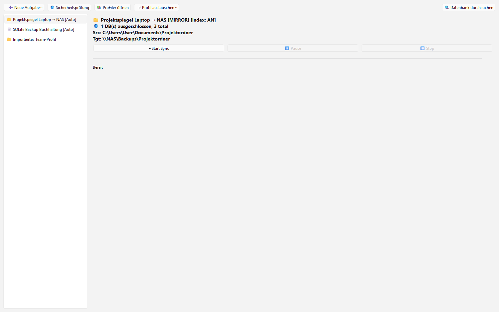

# ProSync

Intelligente Backup-Synchronisation mit Datenbankschutz.

## Features

- **Ordner-Synchronisation** (einseitig / beidseitig)
- **Datei-Synchronisation** fuer einzelne Dateien
- **Automatische Datenbank-Erkennung** und Schutz
- **WAL Checkpoint** fuer SQLite-Dateien vor dem Kopieren
- **System Tray Integration** fuer Hintergrundbetrieb
- **Geplante Backups** mit konfigurierbaren Intervallen
- **Batch-Sync** fuer mehrere ausgewaehlte Verbindungen in einem Lauf
- **Datenbank-Indexierung** fuer Suche und Versionierung (optional)

## Screenshots



## Installation

```bash
pip install -r requirements.txt
```

### Erforderliche Pakete

- PySide6
- (Optional) PyPDF2 fuer PDF-Vorschau im Reader
- (Optional) python-docx fuer Word-Vorschau im Reader

## Verwendung

### Via Python

```bash
python ProSyncStart_V3.1.py
```

### Via Batch-Datei

```bash
START.bat
```

Die Anwendung startet im System Tray. Rechtsklick auf das Icon fuer Optionen.

## Windows-Build

Fuer einen reproduzierbaren lokalen Windows-Build steht `build_exe.bat` bereit.
Das Skript erzeugt `dist/ProSync/ProSync.exe` und kopiert `ProSyncReader.exe`
in denselben Ausgabeordner, damit die Suchoberflaeche auch im Frozen-Modus
weiterhin separat gestartet werden kann.
Build-Artefakte in `build/`, `dist/` und `releases/` werden bewusst nicht versioniert.

### Batch-Ausfuehrung

Waehle mehrere Aufgaben mit `Ctrl` oder `Shift` in der Liste aus und starte sie gesammelt mit
`▶ Batch starten` oder per Kontextmenue. ProSync arbeitet die Auswahl nacheinander ab,
doppelte IDs werden ignoriert und der Batch wird bei Fehlern oder manuellem Stop kontrolliert beendet.

## Synchronisationsmodi

| Modus | Beschreibung | Anwendungsfall |
|-------|-------------|----------------|
| **mirror** | Ziel = exakte Kopie der Quelle | Vollstaendiges Backup |
| **update** | Nur neuere Dateien uebertragen | Inkrementelles Backup |
| **two_way** | Bidirektionale Synchronisation | Sync zwischen zwei Rechnern |
| **one_way** | Quelle → Ziel, keine Loeschungen | Sichere Archivierung |
| **index_only** | Nur Indexierung, kein Kopieren | Dateiverwaltung ohne Sync |

## Beispielszenarien

### 1. Projektordner-Backup

**Aufgabe:** Taegliches Backup eines Entwicklungsprojekts

**Konfiguration:**
- **Quelle:** `C:\Projekte\MeinProjekt`
- **Ziel:** `D:\Backups\MeinProjekt`
- **Modus:** `mirror`
- **Geplant:** Taeglich um 18:00 Uhr
- **Indexierung:** Aktiviert (fuer Suche)

**Ergebnis:** Vollstaendiges Backup mit Dateiversionierung und Suchfunktion

### 2. Synchronisation zwischen Laptop und Desktop

**Aufgabe:** Dateien zwischen zwei PCs synchronisieren

**Konfiguration:**
- **Quelle:** `C:\Dokumente`
- **Ziel:** `\\Desktop-PC\Dokumente`
- **Modus:** `two_way`
- **Geplant:** Alle 30 Minuten
- **Konfliktloesung:** `newest` (neueste Datei gewinnt)

**Ergebnis:** Bidirektionaler Sync, beide PCs haben immer die aktuellen Dateien

### 3. Datenbank-Backup (SQLite mit WAL-Modus)

**Aufgabe:** Sicheres Backup einer SQLite-Datenbank

**Konfiguration:**
- **Typ:** Datei-Verbindung (nicht Ordner!)
- **Quelle:** `C:\App\data.db`
- **Ziel:** `D:\Backups\data.db`
- **Modus:** `one_way`
- **WAL Checkpoint:** Aktiviert
- **Geplant:** Alle 4 Stunden

**Ergebnis:** Konsistente DB-Backups ohne Korruption

## Datenbankschutz (V3.2)

ProSync erkennt kritische Datenbanken automatisch und wendet sichere Einstellungen an:

### Unterstuetzte Datenbanktypen

- **SQLite** (.sqlite, .sqlite3, .db, .db3)
- **MS Access** (.mdb, .accdb)

### Automatische Sicherheitsmassnahmen

#### Fuer Ordner-Verbindungen:
- Kritische DBs (im WAL-Modus) werden **automatisch ausgeschlossen**
- WAL-Dateien (.db-wal, .db-shm, .db-journal) werden **nie kopiert**
- Empfehlung: **Datei-Verbindungen** fuer einzelne DBs erstellen

#### Fuer Datei-Verbindungen:
- **WAL Checkpoint** wird automatisch aktiviert
- **Einweg-Modus** wird empfohlen
- Checkpoint vor jeder Kopieroperation

### Was ist ein WAL Checkpoint?

WAL (Write-Ahead Logging) speichert SQLite-Aenderungen in einer separaten `-wal`-Datei.
Ein Checkpoint fuehrt diese Aenderungen in die Haupt-DB-Datei zurueck.

**Ohne Checkpoint:** Inkonsistente Backups moeglich.
**Mit Checkpoint:** Konsistente DB-Kopie intendiert (abhaengig von SQLite-Checkpoint-Implementierung, keine Gewaehr).

## Konfigurationsdatei

`ProSync_config.json` - Wird lokal automatisch erstellt und verwaltet. Die Datei ist ignoriert, weil sie persönliche Quell-/Zielpfade enthalten kann.
Ein sicheres Beispiel liegt in `ProSync_config.example.json`.

### Beispiel (Ordner-Verbindung):

```json
{
  "connections": [
    {
      "id": "conn-abc123",
      "name": "Projekt Backup",
      "type": "folder",
      "source": "C:\\Projekte\\MeinProjekt",
      "target": "D:\\Backups\\MeinProjekt",
      "mode": "mirror",
      "conflict_policy": "source",
      "indexing": true,
      "db_path": "C:\\Projekte\\MeinProjekt\\profiler_index.db",
      "exclude_patterns": ["*.tmp", "*.lock", "__pycache__"],
      "autosync": {
        "enabled": true,
        "interval_minutes": 60
      }
    }
  ]
}
```

### Beispiel (Datei-Verbindung):

```json
{
  "connections": [
    {
      "id": "conn-def456",
      "name": "Datenbank Backup",
      "type": "file",
      "source_file": "C:\\App\\data.db",
      "target_file": "D:\\Backups\\data.db",
      "mode": "one_way",
      "checkpoint_before_sync": true,
      "autosync": {
        "enabled": true,
        "interval_minutes": 240
      }
    }
  ]
}
```

## ProSyncReader

Ein separates Tool zur Suche in den Sync-Datenbanken.

```bash
python ProSyncReader.py
```

**Features:**
- Volltextsuche in synchronisierten Dateien
- Tag-basierte Suche
- Datei-Vorschau (PDF, DOCX)
- Direktes Oeffnen von Dateien/Ordnern

## Tipps & Best Practices

### Empfohlen:
- **Datei-Verbindungen** fuer einzelne Datenbanken verwenden
- **WAL Checkpoint** fuer SQLite-DBs aktivieren
- Neue Verbindungen zuerst mit einem **manuellen Sync** testen
- **exclude_patterns** fuer temporaere Dateien verwenden

### Vermeiden:
- **two_way** fuer kritische Datenbanken verwenden
- **Laufende** Anwendungen synchronisieren
- **.db-wal**-Dateien manuell kopieren
- **mirror** verwenden, wenn keine Loeschungen gewuenscht sind

## Fehlerbehebung

### "Checkpoint failed"
Datenbank ist gerade geoeffnet/gesperrt. Anwendung schliessen oder Timeout erhoehen.

### "Sync haengt"
Grosse Dateien oder langsame Netzwerkverbindung. `update` statt `mirror` fuer schnellere Syncs verwenden.

### "Datei wurde ausgeschlossen"
`exclude_patterns` in der Konfiguration pruefen. Kritische DBs werden automatisch ausgeschlossen (bei Ordner-Verbindungen).

## System Tray Befehle

- **Linksklick:** Hauptfenster oeffnen
- **Rechtsklick → Ausfuehren:** Verbindung manuell starten
- **Rechtsklick → Auto-Ausfuehrung:** Geplanten Sync aktivieren
- **Rechtsklick → Beenden:** ProSync beenden

## Lizenz

GPL-3.0-only - Siehe [LICENSE](LICENSE)

Dieses Projekt verwendet PySide6 (LGPL).

---

**Version:** 3.2
**Autor:** Lukas Geiger
**Zuletzt aktualisiert:** Mai 2026

---

## English

# ProSync

Intelligent backup synchronization with database safety.

### Features

- **Folder Synchronization** (one-way / two-way)
- **File Synchronization** for individual files
- **Automatic Database Detection** and protection
- **WAL Checkpoint** for SQLite files before copying
- **System Tray Integration** for background operation
- **Scheduled Backups** with configurable intervals
- **Batch Sync** for multiple selected connections in one run
- **Database Indexing** for search and versioning (optional)

### Screenshots


### Installation

```bash
pip install -r requirements.txt
```

#### Required Packages

- PySide6
- (Optional) PyPDF2 for PDF preview in Reader
- (Optional) python-docx for Word preview in Reader

### Usage

#### Via Python

```bash
python ProSyncStart_V3.1.py
```

#### Via Batch File

```bash
START.bat
```

The application starts in the system tray. Right-click the icon for options.

### Windows Build

`build_exe.bat` provides a reproducible local Windows build. It creates
`dist/ProSync/ProSync.exe` and copies `ProSyncReader.exe` into the same output
folder so the search UI can still be launched separately in frozen mode.
Build artifacts in `build/`, `dist/`, and `releases/` are intentionally not versioned.

#### Batch Execution

Select multiple tasks with `Ctrl` or `Shift` in the list and launch them together via
`▶ Batch starten` or the context menu. ProSync runs the selection sequentially,
ignores duplicate IDs, and stops the batch cleanly on errors or manual cancellation.

### Synchronization Modes

| Mode | Description | Use Case |
|------|-------------|----------|
| **mirror** | Target = exact copy of source | Full backup |
| **update** | Transfer only newer files | Incremental backup |
| **two_way** | Bidirectional synchronization | Sync between two workstations |
| **one_way** | Source → target only, no deletions | Safe archiving |
| **index_only** | Indexing only, no copying | File management without sync |

### Example Scenarios

#### 1. Project Folder Backup

**Task:** Daily backup of a development project

**Configuration:**
- **Source:** `C:\Projekte\MeinProjekt`
- **Target:** `D:\Backups\MeinProjekt`
- **Mode:** `mirror`
- **Scheduled:** Daily at 6:00 PM
- **Indexing:** Enabled (for search)

**Result:** Complete backup with file versioning and search functionality

#### 2. Synchronization Between Laptop and Desktop

**Task:** Synchronize files between two PCs

**Configuration:**
- **Source:** `C:\Dokumente`
- **Target:** `\\Desktop-PC\Dokumente`
- **Mode:** `two_way`
- **Scheduled:** Every 30 minutes
- **Conflict Resolution:** `newest` (newest file wins)

**Result:** Bidirectional sync, both PCs always have the latest files

#### 3. Database Backup (SQLite with WAL Mode)

**Task:** Safe backup of a SQLite database

**Configuration:**
- **Type:** File connection (not folder!)
- **Source:** `C:\App\data.db`
- **Target:** `D:\Backups\data.db`
- **Mode:** `one_way`
- **WAL Checkpoint:** Enabled
- **Scheduled:** Every 4 hours

**Result:** Consistent DB backups without corruption

### Database Protection (V3.2)

ProSync automatically detects critical databases and applies safe settings:

#### Supported Database Types

- **SQLite** (.sqlite, .sqlite3, .db, .db3)
- **MS Access** (.mdb, .accdb)

#### Automatic Safety Measures

##### For Folder Connections:
- Critical DBs (in WAL mode) are **automatically excluded**
- WAL files (.db-wal, .db-shm, .db-journal) are **never copied**
- Recommendation: Create **file connections** for individual DBs

##### For File Connections:
- **WAL Checkpoint** is automatically enabled
- **One-way mode** is recommended
- Checkpoint before each copy operation

#### What is WAL Checkpoint?

WAL (Write-Ahead Logging) stores SQLite changes in a separate `-wal` file.
A checkpoint merges these changes back into the main DB file.

**Without checkpoint:** Inconsistent backups possible!
**With checkpoint:** Intended to create a consistent DB copy, depending on SQLite checkpoint behavior.

### Configuration File

`ProSync_config.json` - Automatically created and managed locally. The file is ignored because it can contain personal source/target paths.
A safe example is tracked as `ProSync_config.example.json`.

#### Example (Folder Connection):

```json
{
  "connections": [
    {
      "id": "conn-abc123",
      "name": "Projekt Backup",
      "type": "folder",
      "source": "C:\\Projekte\\MeinProjekt",
      "target": "D:\\Backups\\MeinProjekt",
      "mode": "mirror",
      "conflict_policy": "source",
      "indexing": true,
      "db_path": "C:\\Projekte\\MeinProjekt\\profiler_index.db",
      "exclude_patterns": ["*.tmp", "*.lock", "__pycache__"],
      "autosync": {
        "enabled": true,
        "interval_minutes": 60
      }
    }
  ]
}
```

#### Example (File Connection):

```json
{
  "connections": [
    {
      "id": "conn-def456",
      "name": "Datenbank Backup",
      "type": "file",
      "source_file": "C:\\App\\data.db",
      "target_file": "D:\\Backups\\data.db",
      "mode": "one_way",
      "checkpoint_before_sync": true,
      "autosync": {
        "enabled": true,
        "interval_minutes": 240
      }
    }
  ]
}
```

### ProSyncReader

A separate tool for searching the sync databases.

```bash
python ProSyncReader.py
```

**Features:**
- Full-text search in synchronized files
- Tag-based search
- File preview (PDF, DOCX)
- Direct opening of files/folders

### Tips & Best Practices

#### Recommended:
- Use **file connections** for individual databases
- Enable **WAL Checkpoint** for SQLite DBs
- Test new connections with a **manual sync** first
- Use **exclude_patterns** for temporary files

#### Avoid:
- Use **two_way** for critical databases
- Synchronize **running** applications
- Copy **.db-wal** files manually
- Use **mirror** if you don't want deletions

### Troubleshooting

#### "Checkpoint failed"
Database is currently open/locked. Close the application or increase the timeout.

#### "Sync hangs"
Large files or slow network connection. Use `update` instead of `mirror` for faster syncs.

#### "File was excluded"
Check `exclude_patterns` in the config. Critical DBs are automatically excluded (for folder connections).

### System Tray Commands

- **Left-click:** Open main window
- **Right-click → Run:** Start connection manually
- **Right-click → Auto-run:** Enable scheduled sync
- **Right-click → Exit:** Quit ProSync

### License

GPL-3.0-only - See [LICENSE](LICENSE)

This project uses PySide6 (LGPL).

---

## Haftung / Liability

Dieses Projekt ist eine **unentgeltliche Open-Source-Schenkung** im Sinne der §§ 516 ff. BGB. Die Haftung des Urhebers ist gemäß **§ 521 BGB** auf **Vorsatz und grobe Fahrlässigkeit** beschränkt. Ergänzend gelten die Haftungsausschlüsse aus GPL-3.0-only.

Nutzung auf eigenes Risiko. Keine Wartungszusage, keine Verfügbarkeitsgarantie, keine Gewähr für Fehlerfreiheit oder Eignung für einen bestimmten Zweck.

This project is an unpaid open-source donation. Liability is limited to intent and gross negligence (§ 521 German Civil Code). Use at your own risk. No warranty, no maintenance guarantee, no fitness-for-purpose assumed.

