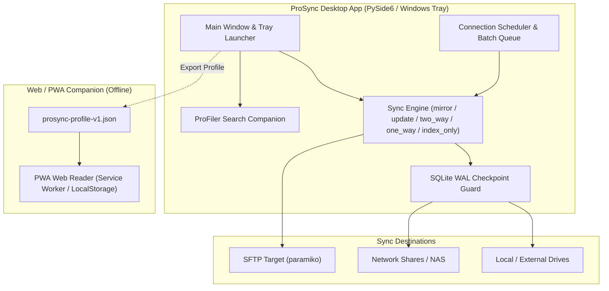
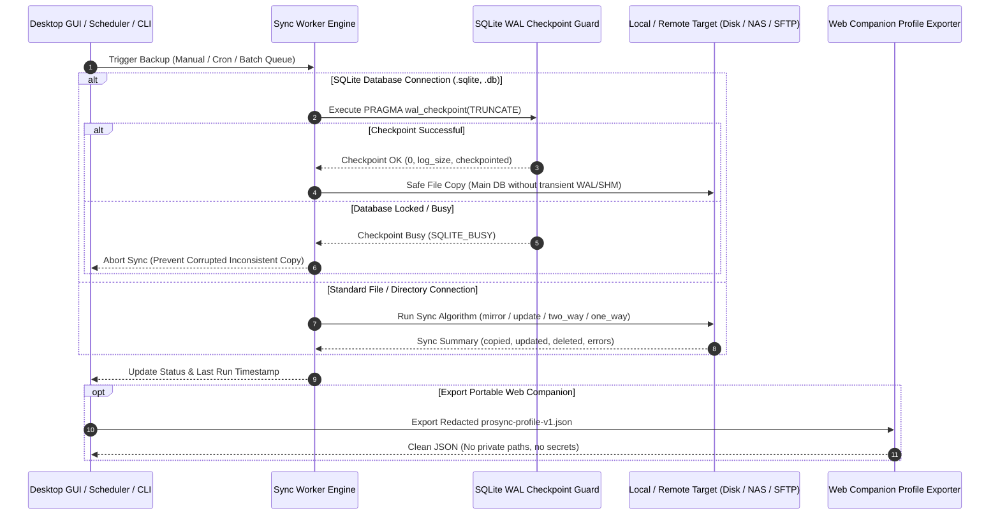

# ProSync

**🇬🇧 English** · **[🇩🇪 Deutsche Dokumentation](README_de.md)**

> Intelligent local backup synchronization with automated SQLite WAL database protection.

[](LICENSE)
[](CHANGELOG.md)
[](#installation)
[](pyproject.toml)
[](#quality-checks)
[](PRIVACY_POLICY.md)
[](SECURITY.md)
[](https://github.com/file-bricks)
[](https://github.com/open-bricks)
[](llms.txt)

> [!NOTE]
> **Disambiguation:** `file-bricks/ProSync` is an open-source Windows desktop and background application built with Python (PySide6) for local file/folder synchronization with automated SQLite WAL database protection. It is completely independent of enterprise database replication products (e.g., Tibero ProSync) or third-party macOS utilities.

**Quick links:** [Features](#features) · [Architecture](#architecture--data-flow) · [Lifecycle Flow](#end-to-end-backup--wal-checkpoint-lifecycle) · [Visual Showcase](#visual-showcase--feature-gallery) · [Installation](#installation) · [CLI Usage](#headless-cli) · [Sync Modes](#synchronization-modes) · [Database Safety](#database-protection-v32) · [Web Companion](#webpwa-companion) · [Sibling Tools](#sibling-tools--file-bricks-ecosystem) · [Security Policy](SECURITY.md) · [User Guide](USER_GUIDE.md) · [Changelog](CHANGELOG.md) · [LLM Context](llms.txt)

---

## Features

- **Folder Synchronization:** Flexible one-way, two-way, update, mirror, and index-only synchronization.
- **File Synchronization:** Dedicated single-file backup connections for mission-critical assets.
- **Automatic Database Detection:** Proactively identifies SQLite (`.db`, `.sqlite`, `.sqlite3`, `.db3`) and MS Access databases.
- **WAL Checkpoint Guard:** Safely executes `PRAGMA wal_checkpoint(TRUNCATE)` before copying active SQLite databases, aborting on lock contention to prevent corruption.
- **System Tray Integration:** Runs unobtrusively in the background on Windows with auto-start and tray menu controls.
- **Scheduled Backups & Daily Triggers:** Configurable interval timers or explicit IANA-timezone-aware daily local execution.
- **Batch Sync Queue:** Select and launch multiple connections sequentially in one coordinated batch.
- **Database Indexing & ProFiler Companion:** Optional full-text indexing and instant search via the companion reader.
- **Portable Web/PWA Companion:** Exports redacted `prosync-profile-v1.json` for offline mobile and browser inspection.
- **Cross-Platform Ready:** Standardized 8-point platform smoke suites for Linux and macOS.
- **Windows Store Staged:** Complete MSIX packaging, AppxManifest declarations, and tile asset sets (Policy 10.1.3 compliant).

---

## Architecture & Data Flow


```mermaid
flowchart TD
    subgraph Desktop["ProSync Desktop App (PySide6 / Windows Tray)"]
        GUI["Main Window & Tray Launcher"]
        SyncEngine["Sync Engine (mirror / update / two_way / one_way / index_only)"]
        WALGuard["SQLite WAL Checkpoint Guard"]
        Scheduler["Connection Scheduler & Batch Queue"]
        Reader["ProFiler Search Companion"]
    end

    subgraph Targets["Sync Destinations"]
        LocalDir["Local / External Drives"]
        NetDir["Network Shares / NAS"]
        SFTP["SFTP Target (paramiko)"]
    end

    subgraph WebCompanion["Web / PWA Companion (Offline)"]
        ProfileJSON["prosync-profile-v1.json"]
        WebPWA["PWA Web Reader (Service Worker / LocalStorage)"]
    end

    GUI --> SyncEngine
    Scheduler --> SyncEngine
    SyncEngine --> WALGuard
    WALGuard --> LocalDir
    WALGuard --> NetDir
    SyncEngine --> SFTP
    GUI --> Reader
    GUI -.->|Export Profile| ProfileJSON
    ProfileJSON --> WebPWA
```

---

## End-to-End Backup & WAL Checkpoint Lifecycle


```mermaid
sequenceDiagram
    autonumber
    participant UI as Desktop GUI / Scheduler / CLI
    participant Sync as Sync Worker Engine
    participant DB as SQLite WAL Checkpoint Guard
    participant FS as Local / Remote Target (Disk / NAS / SFTP)
    participant Export as Web Companion Profile Exporter
    
    UI->>Sync: Trigger Backup (Manual / Cron / Batch Queue)
    alt SQLite Database Connection (.sqlite, .db)
        Sync->>DB: Execute PRAGMA wal_checkpoint(TRUNCATE)
        alt Checkpoint Successful
            DB-->>Sync: Checkpoint OK (0, log_size, checkpointed)
            Sync->>FS: Safe File Copy (Main DB without transient WAL/SHM)
        else Database Locked / Busy
            DB-->>Sync: Checkpoint Busy (SQLITE_BUSY)
            Sync-->>UI: Abort Sync (Prevent Corrupted Inconsistent Copy)
        end
    else Standard File / Directory Connection
        Sync->>FS: Run Sync Algorithm (mirror / update / two_way / one_way)
        FS-->>Sync: Sync Summary (copied, updated, deleted, errors)
    end
    Sync-->>UI: Update Status & Last Run Timestamp
    opt Export Portable Web Companion
        UI->>Export: Export Redacted prosync-profile-v1.json
        Export-->>UI: Clean JSON (No private paths, no secrets)
    end
```

---

## Visual Showcase & Feature Gallery

| Main Overview & Connection Manager | SQLite WAL Database Safety | Portable Profile & PWA Companion |
| :---: | :---: | :---: |
|  |  |  |
| *Multi-task connection manager with scheduled intervals and batch queue.* | *Automated SQLite WAL detection and pre-copy checkpoint validation.* | *Redacted profile export for offline inspection and mobile PWA reader.* |

---

## Installation

Supported Python versions are 3.10 through 3.12 (`>=3.10`).

```bash
pip install -r requirements.txt
```

### Required Packages

- `PySide6` (Desktop GUI & System Tray)
- `paramiko` (SFTP network target support)
- `pypdf` (Optional document search preview in Reader)
- `tzdata` (IANA timezone database for Windows daily scheduler)
- `(Optional) python-docx` for Word document preview in Reader

---

## Usage

### Via Python

```bash
python ProSyncStart_V3.1.py
```

### Headless CLI

```bash
python ProSyncStart_V3.1.py --list
python ProSyncStart_V3.1.py --run "Connection ID or exact name"
python ProSyncStart_V3.1.py --all
```

Use `--config <path-to-ProSync_config.json>` for automation profiles and `--quiet` to suppress status lines during scheduled runs. CLI sync uses the same file and folder workers as the GUI and refuses to run while another ProSync instance holds the runtime lock.

### Via Batch File

```bash
START.bat
```

The application starts in the system tray. Right-click the icon for options.

---

## Windows Build

`build_exe.bat` provides a reproducible local Windows build. It creates `dist/ProSync/ProSync.exe` and copies `ProSyncReader.exe` into the same output folder so the search UI can still be launched separately in frozen mode. Build artifacts in `build/`, `dist/`, and `releases/` are intentionally not versioned.

---

## Synchronization Modes

| Mode | Description | Use Case |
|------|-------------|----------|
| **mirror** | Target = exact copy of source | Full backup |
| **update** | Transfer only newer files | Incremental backup |
| **two_way** | Bidirectional synchronization | Sync between two workstations |
| **one_way** | Source → target only, no deletions | Safe archiving |
| **index_only** | Indexing only, no copying | File management without sync |

---

## Example Scenarios

### 1. Project Folder Backup

**Task:** Daily backup of a development project
- **Source:** `C:\Projekte\MeinProjekt`
- **Target:** `D:\Backups\MeinProjekt`
- **Mode:** `mirror`
- **Scheduled:** Daily at 6:00 PM
- **Indexing:** Enabled (for search)
- **Result:** Complete backup with file versioning and search functionality

### 2. Synchronization Between Laptop and Desktop

**Task:** Synchronize files between two PCs
- **Source:** `C:\Dokumente`
- **Target:** `\\Desktop-PC\Dokumente`
- **Mode:** `two_way`
- **Scheduled:** Every 30 minutes
- **Conflict Resolution:** `newest` (newest file wins)
- **Result:** Bidirectional sync, both PCs always have the latest files

### 3. Database Backup (SQLite with WAL Mode)

**Task:** Safe backup of a SQLite database
- **Type:** File connection (not folder!)
- **Source:** `C:\App\data.db`
- **Target:** `D:\Backups\data.db`
- **Mode:** `one_way`
- **WAL Checkpoint:** Enabled
- **Scheduled:** Every 4 hours
- **Result:** Consistent DB backups without corruption

---

## Database Protection (V3.2)

ProSync automatically detects critical databases and applies safe settings:

### Supported Database Types

- **SQLite** (.sqlite, .sqlite3, .db, .db3)
- **MS Access** (.mdb, .accdb)

### Automatic Safety Measures

#### For Folder Connections:
- Critical DBs (in WAL mode) are **automatically excluded**
- WAL files (`.db-wal`, `.db-shm`, `.db-journal`) are **never copied**
- Recommendation: Create **file connections** for individual DBs

#### For File Connections:
- **WAL Checkpoint** is automatically enabled
- **One-way mode** is recommended
- Checkpoint before each copy operation

### What is WAL Checkpoint?

WAL (Write-Ahead Logging) stores SQLite changes in a separate `-wal` file. A checkpoint merges these changes back into the main DB file.

- **Without checkpoint:** Inconsistent backups possible!
- **With checkpoint:** ProSync copies the database only after a successful checkpoint; a failed or busy checkpoint aborts the sync.

---

## Configuration File

`ProSync_config.json` is automatically created and managed locally. The file is ignored by Git because it can contain personal source/target paths. A safe example is tracked as `ProSync_config.example.json`.

---

## ProSyncReader & ProFiler Companion

A separate tool for searching synchronized databases:

```bash
python ProSyncReader.py
```

- Full-text search in synchronized files
- Tag-based search
- File preview (PDF, DOCX)
- Direct opening of files/folders

ProSync can launch ProFiler directly from the main window. Configured paths may be absolute, relative to the ProSync folder, or use environment variables such as `%USERPROFILE%\\...`.

---

## Portable Web Companion Export

The desktop client can export `prosync-profile-v1.json` through **`⇄ Profil austauschen`**. The Web/PWA companion consumes exactly this redacted format and intentionally keeps it read-only:

- No real source, target, or database paths
- No secrets, tokens, or `app.profiler_path`
- No browser-based sync engine
- No automatic desktop triggering yet

```bash
cd web_companion
python -m http.server 4179
```

---

## Sibling Tools & file-bricks Ecosystem

ProSync is part of the modular **file-bricks** and **open-bricks** desktop ecosystem:

| Repository | Org | Description | Focus Area |
| :--- | :--- | :--- | :--- |
| **[ProSync](https://github.com/file-bricks/ProSync)** | `file-bricks` | Intelligent backup sync & SQLite WAL database protection | Backup & Database Safety |
| **[ExplorerPro](https://github.com/file-bricks/ExplorerPro)** | `file-bricks` | Advanced multi-tab desktop file manager & workspace organizer | File Management |
| **[CloudLockFixer](https://github.com/file-bricks/CloudLockFixer)** | `file-bricks` | Cloud sync lock resolver, offline cache validator & unblocker | Cloud Sync Hygiene |
| **[ProFiler](https://github.com/file-bricks/ProFiler)** | `file-bricks` | Deep file indexing, metadata tagging & search companion | File Indexing & Search |
| **[NoteSpaceLLM](https://github.com/file-bricks/NoteSpaceLLM)** | `file-bricks` | Local desktop notes workspace with AI augmentations | Local Notes & Knowledge |
| **[WinStorePackager](https://github.com/file-bricks/WinStorePackager)** | `file-bricks` | Automated MSIX & Windows Store packaging toolchain | App Store Tooling |
| **[UniversalDocsGrabber](https://github.com/doc-bricks/UniversalDocsGrabber)** | `doc-bricks` | Universal document acquisition, OCR, and redacted PWA reader | Document Processing |
| **[MediaBrain](https://github.com/doc-bricks/MediaBrain)** | `doc-bricks` | Intelligent media cataloging and asset indexing | Media Management |
| **[CleanMarkdown](https://github.com/doc-bricks/CleanMarkdown)** | `doc-bricks` | Markdown sanitization, link validation, and typography linter | Markdown Hygiene |
| **[ellmos-filecommander-mcp](https://github.com/ellmos-ai/ellmos-filecommander-mcp)** | `ellmos-ai` | Local-first 47-tool MCP server for files, search & diagnostics | Agent Tooling |
| **[lock-master](https://github.com/ellmos-ai/lock-master)** | `ellmos-ai` | Distributed agent file-claim coordination & lock arbitration | Agent Concurrency |
| **[WikiStub-Seed](https://github.com/dev-bricks/WikiStub-Seed)** | `dev-bricks` | Automated documentation generator & multilingual stub creator | Developer Tooling |
| **[open-bricks](https://github.com/open-bricks)** | `open-bricks` | Umbrella organization for privacy-first developer tools | Open-Source Umbrella |

---

## Quality Checks

Last verified on 2026-09-12: 104 Python tests and 29 Web/PWA tests passed (133 total tests).

```bash
python -m compileall -q ProSyncStart_V3.1.py ProSyncReader.py prosync_utils.py schedule_time.py logger.py run_tests.py
python run_tests.py
python -m pytest -q
```

Web companion verification:

```bash
cd web_companion
npm test
node --check app.js
node --check library.js
node --check sw.js
```

---

## Privacy and Local Files

`ProSync_config.json`, logs, build artifacts, and local host notes stay outside the repository. The tracked `ProSync_config.example.json` contains only an empty example structure and no personal source or target paths.

The GitHub repository only tracks source code, tests, sample configuration, and project documentation. Personal sync targets, databases, WAL files, temporary locks, and local build outputs are excluded through `.gitignore`. See [PRIVACY_POLICY.md](PRIVACY_POLICY.md) for full privacy guarantees, [SECURITY.md](SECURITY.md) for vulnerability reporting and local-first safety, and [SUPPORT.md](SUPPORT.md) for issue tracking.

For Microsoft Store packaging details and local-first compliance, refer to [WINDOWS_STORE_PREP.md](WINDOWS_STORE_PREP.md).

---

## System Tray Commands

- **Left-click:** Open main window
- **Right-click → Run:** Start connection manually
- **Right-click → Auto-run:** Enable scheduled sync
- **Right-click → Exit:** Quit ProSync

---

## License

MIT - See [LICENSE](LICENSE)

This project uses PySide6 (LGPL).
