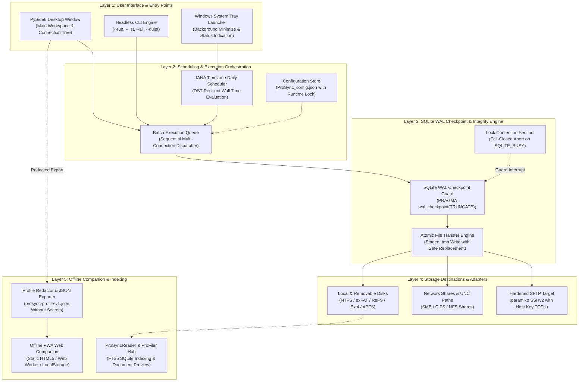
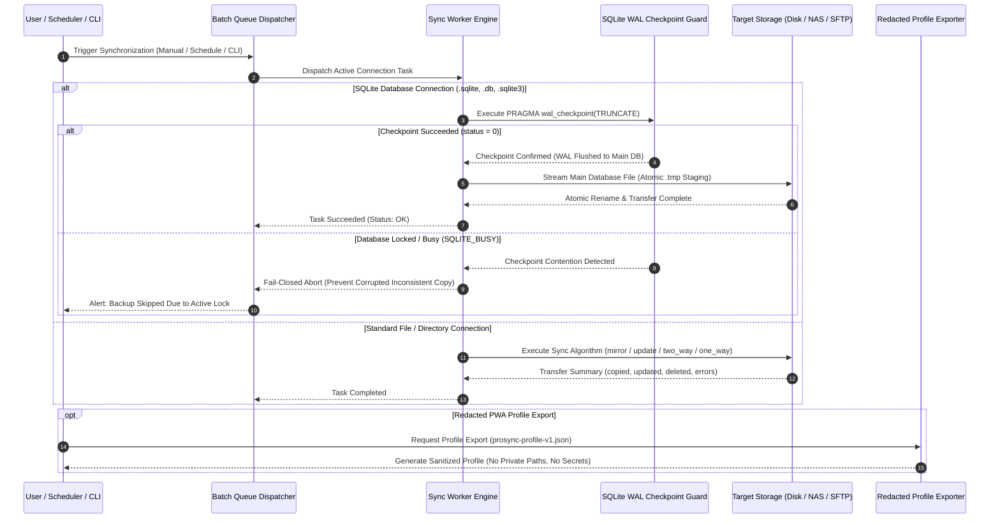

# ProSync

[English](README.md) · [Deutsch](README_de.md) · [User Guide](USER_GUIDE.md)

> Intelligent local backup synchronization with automated SQLite WAL database protection.

[](LICENSE)
[](CHANGELOG.md)
[](#10-installation--dependencies)
[](pyproject.toml)
[](#16-testing--quality-checks)
[](PRIVACY_POLICY.md)
[](SECURITY.md)
[](SECURITY.md)
[](THIRD_PARTY_LICENSES.md)
[](https://github.com/file-bricks)
[](https://github.com/open-bricks)
[](llms.txt)
[](CHANGELOG.md)

> [!NOTE]
> **Disambiguation:** `file-bricks/ProSync` is an open-source Windows desktop and background application built with Python (PySide6) for local file/folder synchronization with automated SQLite WAL database protection. It is completely independent of enterprise database replication products (e.g., Tibero ProSync) or third-party macOS utilities.

**Machine-readable index:** Specification available at [`llms.txt`](llms.txt). Last checked: **2026-09-18**.

---

## Quick Navigation

1. [Features & Core Capabilities](#1-features)
2. [System Architecture & Data Flow](#2-architecture)
3. [Target Personas & Discoverability](#3-target-personas--discoverability)
4. [Comparative Matrix vs. Alternatives](#4-comparative-matrix-vs-alternatives)
5. [Dual Mermaid Diagrams](#5-dual-mermaid-diagrams)
6. [Governance & Runtime Invariants](#6-governance--runtime-invariants)
7. [Synchronization Modes & Semantics](#7-synchronization-modes)
8. [SQLite WAL Database Protection](#8-sqlite-wal-database-protection)
9. [Visual Showcase & Feature Gallery](#9-visual-showcase--feature-gallery)
10. [Installation & Dependencies](#10-installation--dependencies)
11. [CLI & Headless Automation](#11-cli--headless-automation)
12. [Scheduled Backups & IANA Timezones](#12-scheduled-backups--iana-timezones)
13. [Portable Web/PWA Companion](#13-portable-webpwa-companion)
14. [ProSyncReader & ProFiler Search](#14-prosyncreader--profiler-search)
15. [Windows Store & MSIX Staging](#15-windows-store--msix-staging)
16. [Testing & Quality Checks](#16-testing--quality-checks)
17. [Third-Party Licenses & Transparency](#17-third-party-licenses--transparency)
18. [Security Policy & Sibling Ecosystem](#18-security-policy--sibling-ecosystem)

---

<a id="1-features"></a>
<a id="features"></a>
<a id="key-features"></a>
<a id="1-funktionen"></a>
<a id="funktionen"></a>
<a id="hauptfunktionen"></a>
## 1. Features & Core Capabilities

- **Folder Synchronization:** Flexible one-way, two-way, update, mirror, and index-only synchronization.
- **File Synchronization:** Dedicated single-file backup connections for mission-critical assets.
- **Automatic Database Detection:** Proactively identifies SQLite (`.db`, `.sqlite`, `.sqlite3`, `.db3`) and MS Access databases.
- **WAL Checkpoint Guard:** Safely executes `PRAGMA wal_checkpoint(TRUNCATE)` before copying active SQLite databases, aborting fail-closed on lock contention (`SQLITE_BUSY`) to prevent corruption.
- **System Tray Integration:** Runs unobtrusively in the background on Windows with auto-start and tray menu controls.
- **Scheduled Backups & Daily Triggers:** Configurable interval timers or explicit IANA-timezone-aware daily local execution across DST transitions.
- **Batch Sync Queue:** Select and launch multiple connections sequentially in one coordinated batch with granular progress feedback.
- **Atomic File Operations:** Staged temporary writes (`.tmp`) prior to atomic replacement, preventing partial or corrupted targets during power loss.
- **Database Indexing & ProFiler Companion:** Optional full-text indexing and instant search via the companion reader.
- **Portable Web/PWA Companion:** Exports redacted `prosync-profile-v1.json` for offline mobile and browser inspection.
- **Cross-Platform Ready:** Standardized 8-point platform smoke suites for Linux and macOS.
- **Windows Store Staged:** Complete MSIX packaging, AppxManifest declarations, and tile asset sets (Policy 10.1.3 compliant).

---

<a id="2-architecture"></a>
<a id="architecture"></a>
<a id="architecture--data-flow"></a>
<a id="2-architektur"></a>
<a id="architektur"></a>
<a id="architektur--datenfluss"></a>
## 2. System Architecture & Data Flow

ProSync separates user interaction, synchronization scheduling, database integrity validation, and storage targets into modular decoupled layers:

```
+---------------------------------------------------------------------------------+
|                                 USER INTERFACE                                  |
|   +------------------------------------+   +--------------------------------+   |
|   | PySide6 Desktop GUI (Main Window)  |   | System Tray Background Monitor |   |
|   +------------------------------------+   +--------------------------------+   |
|   +------------------------------------+   +--------------------------------+   |
|   | Headless CLI (--run / --all)       |   | ProSyncReader Search Companion |   |
|   +------------------------------------+   +--------------------------------+   |
+---------------------------------------------------------------------------------+
                                         |
                                         v
+---------------------------------------------------------------------------------+
|                           SCHEDULER & BATCH ENGINE                              |
|   ├── IANA Timezone Evaluator (DST Safe)   ├── Batch Sync Execution Queue       |
|   └── Configuration Manager                └── Instance Lock Coordinator        |
+---------------------------------------------------------------------------------+
                                         |
                                         v
+---------------------------------------------------------------------------------+
|                        SYNC & INTEGRITY ENGINE (CORE)                           |
|   ├── SQLite WAL Checkpoint Guard (PRAGMA wal_checkpoint(TRUNCATE))             |
|   ├── Lock Contention Sentinel (SQLITE_BUSY Fail-Closed Abort)                  |
|   ├── Atomic Staging & Temporary File Copier (.tmp Safe Replace)                |
|   └── Mode Logic: mirror | update | two_way | one_way | index_only              |
+---------------------------------------------------------------------------------+
                                         |
                                         v
+---------------------------------------------------------------------------------+
|                              STORAGE DESTINATIONS                               |
|   ├── Local Drives (NTFS, exFAT, APFS, Ext4)                                    |
|   ├── Network Attached Storage (NAS / SMB / CIFS UNC paths)                     |
|   └── SFTP Remote Endpoints (Hardened Paramiko with Host Key TOFU)              |
+---------------------------------------------------------------------------------+
```

---

<a id="3-target-personas--discoverability"></a>
<a id="target-personas--discoverability"></a>
<a id="target-personas"></a>
<a id="3-zielgruppen--auffindbarkeit"></a>
<a id="zielgruppen--auffindbarkeit"></a>
<a id="zielgruppen"></a>
## 3. Target Personas & Discoverability

### Target Personas

- **[PERSONA-01] Desktop Power Users & Windows Sysadmins:**
  - *Context:* Automating regular backups of vital working directories, NAS shares, and external NVMe/USB drives.
  - *Pain Point:* Generic sync utilities either lack background tray operation, lack resilient scheduling, or corrupt open SQLite databases during live copies.
  - *How ProSync Solves It:* Unobtrusive system-tray automation, IANA-timezone-aware daily triggers, batch queues, and atomic folder synchronization with fail-closed safety.

- **[PERSONA-02] SQLite & Database Application Developers:**
  - *Context:* Development and production desktop environments utilizing SQLite in WAL (Write-Ahead Logging) mode.
  - *Pain Point:* Standard copy tools copy active database files while WAL transactions are uncommitted, producing inconsistent, corrupt, or unusable backup copies.
  - *How ProSync Solves It:* Automated pre-sync SQLite WAL checkpointing (`PRAGMA wal_checkpoint(TRUNCATE)`), defensive lock contention detection (fail-closed on `SQLITE_BUSY`), and automated WAL auxiliary file exclusion (`.db-wal`, `.db-shm`).

- **[PERSONA-03] Privacy & Compliance Officers / DSGVO & Enterprise Auditors:**
  - *Context:* Regulated industries, legal/medical records, and sensitive local file archives requiring strict confidentiality.
  - *Pain Point:* Cloud storage clients and commercial SaaS synchronization tools continuously exfiltrate telemetry, analytics, and metadata.
  - *How ProSync Solves It:* Uncompromising 100% Local-First & Zero-Egress architecture; zero external telemetry sockets; fully unprivileged user-mode execution (`RunAsInvoker`).

- **[PERSONA-04] Automation Engineers & Multi-Agent Framework Architects:**
  - *Context:* Headless script execution, CI validation pipelines, batch scripts, and LLM-assisted toolchains.
  - *Pain Point:* Inflexible GUI-only tools that cannot be scripted without window managers or user clicks.
  - *How ProSync Solves It:* Full-featured headless CLI (`--list`, `--run <id|name>`, `--all`, `--quiet`), redacted portable profile export format (`prosync-profile-v1.json`), and comprehensive automated contract test suites.

### High-Intent Search Queries

- *"python desktop backup synchronization tool"*
- *"pyside6 file sync folder backup windows tray"*
- *"sqlite wal database safe backup python"*
- *"local-first file synchronization zero egress"*
- *"offline two-way folder sync python"*
- *"sqlite wal checkpoint backup automation"*
- *"scheduled folder backup iana timezone python"*
- *"sftp atomic upload backup desktop app"*
- *"windows store msix backup sync utility"*
- *"open source backup sync tool mit license"*

---

<a id="4-comparative-matrix-vs-alternatives"></a>
<a id="comparative-matrix-vs-alternatives"></a>
<a id="comparative-matrix"></a>
<a id="4-vergleichsmatrix-gegenueber-alternativen"></a>
<a id="vergleichsmatrix-gegenueber-alternativen"></a>
<a id="vergleichsmatrix"></a>
## 4. Comparative Matrix vs. Alternatives

| Technical Dimension / Invariant | ProSync (`file-bricks`) | FreeFileSync | Robocopy / Rsync | Syncthing | Commercial Cloud SaaS Sync |
|---|---|---|---|---|---|
| **INV-LOCAL-01 Local-First & Zero Egress** | **100% Local & Offline** | 100% Local | 100% Local | P2P Network Protocol | Cloud Relay / Telemetry |
| **INV-RUNAS-02 RunAsInvoker User Mode** | **Strictly Unprivileged** | Native Installer | OS Built-in | User / Daemon | System Service / Elevation |
| **INV-WAL-03 SQLite WAL Checkpoint Guard** | **Automated `PRAGMA wal_checkpoint`** | None (Raw Copy) | None (Raw Copy) | None (File Watcher) | None (Locked File Error) |
| **INV-INTEG-04 Atomic Staging & Replacement** | **Staged `.tmp` Safe Replace** | Direct Stream | Direct Stream | Temp Staging | Chunk Upload Staging |
| **INV-SCHED-05 DST-Aware IANA Scheduling** | **Built-in IANA Timezone Engine** | Windows Task Scheduler | Task Scheduler / Cron | Continuous Watcher | Cloud Schedule / Poll |
| **INV-PWA-06 Redacted Offline Companion** | **Export `prosync-profile-v1.json`** | None | None | Web GUI (Localhost) | Web Dashboard (Online) |
| **INV-PLAT-07 Cross-Platform Smoke Parity** | **Windows, Linux & macOS Matrix** | Windows, macOS, Linux | OS-specific | Go Cross-Platform | Platform-specific Apps |
| **INV-STORE-08 Windows Store / MSIX Staging** | **AppxManifest & Policy 10.1.3** | Standalone Setup | None | Chocolatey / Scoop | Windows Store App |
| **INV-DOCS-09 1:1 Bilingual Docs & LLM Index** | **18-Point EN/DE + `llms.txt`** | English Docs | Man Pages / Docs | English Docs | Online Help Center |
| **INV-SLA-10 Open Source Governance & SLA** | **MIT License, 48h Response SLA** | GPL v3 | OS Proprietary / GPL | MPL 2.0 | Proprietary Commercial |

---

<a id="5-dual-mermaid-diagrams"></a>
<a id="dual-mermaid-diagrams"></a>
<a id="mermaid-diagrams"></a>
<a id="end-to-end-backup--wal-checkpoint-lifecycle"></a>
<a id="5-duale-mermaid-diagramme"></a>
<a id="duale-mermaid-diagramme"></a>
<a id="mermaid-diagramme"></a>
<a id="end-to-end-backup--wal-checkpoint-lebenszyklus"></a>
## 5. Dual Mermaid Diagrams

### System Architecture Topology (`flowchart TD`)


```mermaid
flowchart TD
    subgraph Layer1 ["Layer 1: User Interface & Entry Points"]
        UI_GUI["PySide6 Desktop Window<br/>(Main Workspace & Connection Tree)"]
        UI_TRAY["Windows System Tray Launcher<br/>(Background Minimize & Status Indication)"]
        UI_CLI["Headless CLI Engine<br/>(--run, --list, --all, --quiet)"]
    end

    subgraph Layer2 ["Layer 2: Scheduling & Execution Orchestration"]
        SCHED["IANA Timezone Daily Scheduler<br/>(DST-Resilient Wall Time Evaluation)"]
        QUEUE["Batch Execution Queue<br/>(Sequential Multi-Connection Dispatcher)"]
        CONF["Configuration Store<br/>(ProSync_config.json with Runtime Lock)"]
    end

    subgraph Layer3 ["Layer 3: SQLite WAL Checkpoint & Integrity Engine"]
        WAL_GUARD["SQLite WAL Checkpoint Guard<br/>(PRAGMA wal_checkpoint(TRUNCATE))"]
        ATOMIC_COPY["Atomic File Transfer Engine<br/>(Staged .tmp Write with Safe Replacement)"]
        LOCK_CHECK["Lock Contention Sentinel<br/>(Fail-Closed Abort on SQLITE_BUSY)"]
    end

    subgraph Layer4 ["Layer 4: Storage Destinations & Adapters"]
        DEST_LOCAL["Local & Removable Disks<br/>(NTFS / exFAT / ReFS / Ext4 / APFS)"]
        DEST_NAS["Network Shares & UNC Paths<br/>(SMB / CIFS / NFS Shares)"]
        DEST_SFTP["Hardened SFTP Target<br/>(paramiko SSHv2 with Host Key TOFU)"]
    end

    subgraph Layer5 ["Layer 5: Offline Companion & Indexing"]
        EXP_PWA["Profile Redactor & JSON Exporter<br/>(prosync-profile-v1.json Without Secrets)"]
        APP_PWA["Offline PWA Web Companion<br/>(Static HTML5 / Web Worker / LocalStorage)"]
        SEARCH_PRO["ProSyncReader & ProFiler Hub<br/>(FTS5 SQLite Indexing & Document Preview)"]
    end

    UI_GUI --> QUEUE
    UI_TRAY --> SCHED
    UI_CLI --> QUEUE
    SCHED --> QUEUE
    CONF -.-> QUEUE

    QUEUE --> WAL_GUARD
    WAL_GUARD --> ATOMIC_COPY
    LOCK_CHECK -.->|"Guard Interrupt"| WAL_GUARD

    ATOMIC_COPY --> DEST_LOCAL
    ATOMIC_COPY --> DEST_NAS
    ATOMIC_COPY --> DEST_SFTP

    UI_GUI -.->|"Redacted Export"| EXP_PWA
    EXP_PWA --> APP_PWA
    DEST_LOCAL -.-> SEARCH_PRO
```

### End-to-End Backup & WAL Checkpoint Lifecycle (`sequenceDiagram`)


```mermaid
sequenceDiagram
    autonumber
    participant U as User / Scheduler / CLI
    participant Q as Batch Queue Dispatcher
    participant W as Sync Worker Engine
    participant G as SQLite WAL Checkpoint Guard
    participant D as Target Storage (Disk / NAS / SFTP)
    participant E as Redacted Profile Exporter

    U->>Q: Trigger Synchronization (Manual / Schedule / CLI)
    Q->>W: Dispatch Active Connection Task
    alt SQLite Database Connection (.sqlite, .db, .sqlite3)
        W->>G: Execute PRAGMA wal_checkpoint(TRUNCATE)
        alt Checkpoint Succeeded (status = 0)
            G-->>W: Checkpoint Confirmed (WAL Flushed to Main DB)
            W->>D: Stream Main Database File (Atomic .tmp Staging)
            D-->>W: Atomic Rename & Transfer Complete
            W-->>Q: Task Succeeded (Status: OK)
        else Database Locked / Busy (SQLITE_BUSY)
            G-->>W: Checkpoint Contention Detected
            W-->>Q: Fail-Closed Abort (Prevent Corrupted Inconsistent Copy)
            Q-->>U: Alert: Backup Skipped Due to Active Lock
        end
    else Standard File / Directory Connection
        W->>D: Execute Sync Algorithm (mirror / update / two_way / one_way)
        D-->>W: Transfer Summary (copied, updated, deleted, errors)
        W-->>Q: Task Completed
    end
    opt Redacted PWA Profile Export
        U->>E: Request Profile Export (prosync-profile-v1.json)
        E-->>U: Generate Sanitized Profile (No Private Paths, No Secrets)
    end
```

---

<a id="6-governance--runtime-invariants"></a>
<a id="governance--runtime-invariants"></a>
<a id="runtime-invariants"></a>
<a id="6-governance--laufzeit-invarianten"></a>
<a id="governance--laufzeit-invarianten"></a>
<a id="laufzeit-invarianten"></a>
## 6. Governance & Runtime Invariants

ProSync strictly enforces ten foundational governance and runtime invariants:

| Invariant | Title | Enforcement & Description |
|---|---|---|
| `INV-LOCAL-01` | **Local-First & Zero Egress** | Pure local runtime. Zero network sockets opened to telemetry, tracking, or analytics endpoints. Verified in `tests/test_security_license_contract.py`. |
| `INV-RUNAS-02` | **Unprivileged RunAsInvoker** | Runs purely in unprivileged user space. Never prompts for UAC elevation or root credentials. Documented in `SECURITY.md` and `pyproject.toml`. |
| `INV-WAL-03` | **SQLite WAL Crash Safety** | Automated `PRAGMA wal_checkpoint(TRUNCATE)` prior to copying active SQLite databases; aborts fail-closed on lock contention (`SQLITE_BUSY`). |
| `INV-INTEG-04` | **Atomic File Copy Staging** | File writes stage to `.tmp` files before atomic replacement, guaranteeing target files are never left in a corrupted state. |
| `INV-SCHED-05` | **DST-Aware Daily Scheduling** | Built-in IANA timezone engine calculates exact wall time, eliminating drift and catch-up storms during daylight saving time shifts. |
| `INV-PWA-06` | **Redacted Companion Export** | Exported `prosync-profile-v1.json` strips absolute file paths, private server endpoints, passwords, and tokens for safe offline companion viewing. |
| `INV-PLAT-07` | **Cross-Platform Smoke Parity** | 8-point smoke test suites for Linux and macOS verify system opener commands, offscreen UI lifecycles, and POSIX path safety. |
| `INV-STORE-08` | **Windows Store & MSIX Staging** | Verified Desktop Bridge AppxManifest (`Geiger.ProSync`), Policy 10.1.3 compliant search keywords, and full tile icon suites. |
| `INV-DOCS-09` | **1:1 Bilingual Documentation** | Exact reciprocal quick navigation parity across English (`README.md`) and German (`README_de.md`), synchronized with `llms.txt`. |
| `INV-SLA-10` | **Open Source Governance & SLA** | Permissive MIT License, public issue triage, and committed 48-hour response / 5-day triage security SLA in `SECURITY.md`. |

---

<a id="7-synchronization-modes"></a>
<a id="synchronization-modes"></a>
<a id="sync-modes"></a>
<a id="7-synchronisationsmodi"></a>
<a id="synchronisationsmodi"></a>
<a id="synchronisations-modi"></a>
## 7. Synchronization Modes & Semantics

ProSync provides five deterministic synchronization modes to suit various backup and archival workflows:

| Mode | Semantic Behavior | Primary Use Case |
|---|---|---|
| **`mirror`** | Target is maintained as an exact replica of source (deleting orphaned target files) | Full system & repository backups |
| **`update`** | Transfers only newer and missing files from source to target (no target deletions) | Incremental day-to-day backups |
| **`two_way`** | Bidirectional synchronization resolving conflicts by newest timestamp | Active sync between laptop and workstation |
| **`one_way`** | Source files copied to target without ever deleting files from target | Safe non-destructive archival |
| **`index_only`** | Indexes metadata and file structure without moving payload bytes | Cataloging & ProFiler search preparation |

---

<a id="8-sqlite-wal-database-protection"></a>
<a id="sqlite-wal-database-protection"></a>
<a id="database-protection-v32"></a>
<a id="database-safety"></a>
<a id="8-sqlite-wal-datenbankschutz"></a>
<a id="sqlite-wal-datenbankschutz"></a>
<a id="datenbankschutz-v32"></a>
<a id="datenbankschutz"></a>
## 8. SQLite WAL Database Protection

ProSync proactively detects active SQLite database files and enforces crash-consistent protection mechanisms:

### Supported Database Extensions
- **SQLite:** `.sqlite`, `.sqlite3`, `.db`, `.db3`
- **MS Access:** `.mdb`, `.accdb`

### Protection Rules
1. **Automatic Exclusion in Folder Sync:** When syncing folders containing live databases, WAL auxiliary files (`.db-wal`, `.db-shm`, `.db-journal`) are automatically excluded from generic file copying to prevent inconsistent target states.
2. **Dedicated File Connections:** For live databases, users configure a dedicated **File Connection** with WAL Checkpoint enabled.
3. **Automated Checkpoint:** Before copying, ProSync issues `PRAGMA wal_checkpoint(TRUNCATE)`:
   - **Success (0):** The WAL journal is completely integrated into the main database file, which is then copied atomically.
   - **Contention / Busy:** If another process holds an active write lock, ProSync aborts the copy operation immediately, logging `SQLITE_BUSY` to prevent creating a corrupted partial snapshot.

---

<a id="9-visual-showcase--feature-gallery"></a>
<a id="visual-showcase--feature-gallery"></a>
<a id="visual-showcase"></a>
<a id="9-visuelle-vorschau--feature-galerie"></a>
<a id="visuelle-vorschau--feature-galerie"></a>
<a id="visual-showcase--galerie"></a>
## 9. Visual Showcase & Feature Gallery

| Main Overview & Connection Manager | SQLite WAL Database Safety | Portable Profile & PWA Companion |
| :---: | :---: | :---: |
|  |  |  |
| *Multi-task connection manager with scheduled intervals and batch queue.* | *Automated SQLite WAL detection and pre-copy checkpoint validation.* | *Redacted profile export for offline inspection and mobile PWA reader.* |

---

<a id="10-installation--dependencies"></a>
<a id="installation--dependencies"></a>
<a id="installation"></a>
<a id="10-installation--abhaengigkeiten"></a>
<a id="installation--abhaengigkeiten"></a>
## 10. Installation & Dependencies

ProSync supports Python 3.10, 3.11, and 3.12 (`>=3.10`).

```bash
pip install -r requirements.txt
```

### Core Runtime Dependencies
- `PySide6 >= 6.5.0` (GUI & system tray integration)
- `paramiko >= 3.4.0` (Hardened SFTP network transport)
- `tzdata >= 2025.2` (IANA timezone database for Windows scheduling)
- `pypdf >= 4.0.0` (Pure-Python document preview in ProSyncReader)
- `(Optional) python-docx` (Word document search preview)

---

<a id="11-cli--headless-automation"></a>
<a id="cli--headless-automation"></a>
<a id="headless-cli"></a>
<a id="usage"></a>
<a id="11-cli--headless-automatisierung"></a>
<a id="cli--headless-automatisierung"></a>
<a id="verwendung"></a>
## 11. CLI & Headless Automation

ProSync includes a complete headless command-line interface for scheduled tasks and headless servers:

```bash
# List all configured connections and their status
python ProSyncStart_V3.1.py --list

# Execute a specific connection by ID or exact name
python ProSyncStart_V3.1.py --run "Daily Project Mirror"

# Execute all enabled connections sequentially
python ProSyncStart_V3.1.py --all

# Run quietly in automated environments
python ProSyncStart_V3.1.py --all --quiet --config path/to/config.json
```

---

<a id="12-scheduled-backups--iana-timezones"></a>
<a id="scheduled-backups--iana-timezones"></a>
<a id="scheduled-backups"></a>
<a id="12-zeitgesteuerte-backups--iana-zeitzonen"></a>
<a id="zeitgesteuerte-backups--iana-zeitzonen"></a>
<a id="zeitgesteuerte-backups"></a>
## 12. Scheduled Backups & IANA Timezones

ProSync features a robust scheduling engine with dual trigger modes:
1. **Periodic Interval:** Runs every `N` minutes or hours while ProSync resides in the system tray.
2. **Daily Local Wall-Time:** Triggers at an exact local time (e.g., `18:00`). ProSync utilizes Python's `zoneinfo` and `tzdata` to handle daylight saving time (DST) transitions cleanly without missed backups or duplicate execution cascades.

---

<a id="13-portable-webpwa-companion"></a>
<a id="portable-webpwa-companion"></a>
<a id="webpwa-companion"></a>
<a id="portable-web-companion-export"></a>
<a id="13-portabler-webpwa-begleiter"></a>
<a id="portabler-webpwa-begleiter"></a>
<a id="web-companion"></a>
<a id="portabler-web-companion-export"></a>
## 13. Portable Web/PWA Companion

The desktop client exports a sanitized configuration file (`prosync-profile-v1.json`) via **`⇄ Profil austauschen`**. The companion reader in `web_companion/` provides offline inspection:
- Completely offline: static HTML5, CSS, and Service Worker.
- Zero secrets: local filesystem paths and credentials are automatically redacted.
- Accessible on mobile devices or local tablets via local HTTP preview:

```bash
cd web_companion
python -m http.server 4179
```

---

<a id="14-prosyncreader--profiler-search"></a>
<a id="prosyncreader--profiler-search"></a>
<a id="prosyncreader--profiler-companion"></a>
<a id="14-prosyncreader--profiler-suche"></a>
<a id="prosyncreader--profiler-suche"></a>
<a id="prosyncreader--profiler-begleiter"></a>
## 14. ProSyncReader & ProFiler Search

ProSync integrates seamlessly with the **ProFiler** companion search utility (`ProSyncReader.py`):
- Full-text search across synchronized files and SQLite metadata catalogs.
- Instant preview for PDF and text documents.
- Direct launch integration from the ProSync main interface.

```bash
python ProSyncReader.py
```

---

<a id="15-windows-store--msix-staging"></a>
<a id="windows-store--msix-staging"></a>
<a id="windows-build"></a>
<a id="15-windows-store--msix-bereitstellung"></a>
<a id="windows-store--msix-bereitstellung"></a>
<a id="windows-build-de"></a>
## 15. Windows Store & MSIX Staging

ProSync includes complete Microsoft Store / MSIX staging materials:
- **AppxManifest:** Located at `store_package/ProSync/AppxManifest.xml` with Desktop Bridge identity `Geiger.ProSync`.
- **Policy 10.1.3 Compliance:** Rigorously curated keywords (max 7 high-intent terms).
- **Automated Verification:**
  ```bash
  python scripts/check_store_readiness.py
  ```
- **Local Executable Build:** `build_exe.bat` creates standalone frozen executables for Windows.

---

<a id="16-testing--quality-checks"></a>
<a id="testing--quality-checks"></a>
<a id="quality-checks"></a>
<a id="16-tests--qualitaetssicherung"></a>
<a id="tests--qualitaetssicherung"></a>
<a id="qualitaetssicherung"></a>
## 16. Testing & Quality Checks

Last verified on **2026-09-18**: 124 Python tests and 29 Web/PWA tests passed (153 total tests).

```bash
# Compile check across all core modules
python -m compileall -q ProSyncStart_V3.1.py ProSyncReader.py prosync_utils.py schedule_time.py logger.py run_tests.py

# Run comprehensive test suite
python -m pytest -ra -v

# Run local orchestrator
python run_tests.py

# Lint with Ruff
python -m ruff check .

# Verify web companion test suite
cd web_companion
npm test
node --check app.js
node --check library.js
node --check sw.js
```

---

<a id="17-third-party-licenses--transparency"></a>
<a id="third-party-licenses--transparency"></a>
<a id="license"></a>
<a id="17-drittanbieter-lizenzen--transparenz"></a>
<a id="drittanbieter-lizenzen--transparenz"></a>
<a id="lizenz"></a>
## 17. Third-Party Licenses & Transparency

ProSync is licensed under the permissive [MIT License](LICENSE).

- **Dynamic Linking Isolation:** PySide6 (LGPL-3.0) and Paramiko (LGPL-2.1) are dynamically linked via standard CPython wheels. In standalone distributions, Qt shared objects remain separate in compliance with LGPL-3.0 Section 4.
- **Unprivileged User Mode (`RunAsInvoker`):** Strictly executes in unprivileged user space without administrative prompts.
- **Detailed Software Inventory:** Refer to [THIRD_PARTY_LICENSES.md](THIRD_PARTY_LICENSES.md) and [THIRD_PARTY_LICENSES.txt](THIRD_PARTY_LICENSES.txt) for complete SPDX identifiers, URLs, and upstream notices.

---

<a id="18-security-policy--sibling-ecosystem"></a>
<a id="security-policy--sibling-ecosystem"></a>
<a id="sibling-tools--file-bricks-ecosystem"></a>
<a id="sibling-tools"></a>
<a id="privacy-and-local-files"></a>
<a id="18-sicherheitsrichtlinie--geschwister-oekosystem"></a>
<a id="sicherheitsrichtlinie--geschwister-oekosystem"></a>
<a id="geschwister-werkzeuge--file-bricks-okosystem"></a>
<a id="datenschutz-und-lokale-dateien"></a>
## 18. Security Policy & Sibling Ecosystem

ProSync is maintained by **file-bricks** under the **open-bricks** open-source initiative. For vulnerability reporting, consult [SECURITY.md](SECURITY.md) (48-hour response SLA).

### Sibling Ecosystem Matrix

| Repository | Org | Description | Focus Area |
| :--- | :--- | :--- | :--- |
| **[ProSync](https://github.com/file-bricks/ProSync)** | `file-bricks` | Intelligent backup sync & SQLite WAL database protection | Backup & Database Safety |
| **[ExplorerPro](https://github.com/file-bricks/ExplorerPro)** | `file-bricks` | Advanced multi-tab desktop file manager & workspace organizer | File Management |
| **[CloudLockFixer](https://github.com/file-bricks/CloudLockFixer)** | `file-bricks` | Cloud sync lock resolver, offline cache validator & unblocker | Cloud Sync Hygiene |
| **[ProFiler](https://github.com/file-bricks/ProFiler)** | `file-bricks` | Deep file indexing, metadata tagging & search companion | File Indexing & Search |
| **[NoteSpaceLLM](https://github.com/file-bricks/NoteSpaceLLM)** | `file-bricks` | Local desktop notes workspace with AI augmentations | Local Notes & Knowledge |
| **[WinStorePackager](https://github.com/file-bricks/WinStorePackager)** | `file-bricks` | Automated MSIX & Windows Store packaging toolchain | App Store Tooling |
| **[UniversalDocsGrabber](https://github.com/doc-bricks/UniversalDocsGrabber)** | `doc-bricks` | Universal document acquisition, OCR, and redacted PWA reader | Document Processing |
| **[MediaBrain](https://github.com/doc-bricks/MediaBrain)** | `doc-bricks` | Intelligent media cataloging and asset indexing | Media Management |
| **[CleanMarkdown](https://github.com/doc-bricks/CleanMarkdown)** | `doc-bricks` | Markdown sanitization, link validation, and typography linter | Markdown Hygiene |
| **[ellmos-filecommander-mcp](https://github.com/ellmos-ai/ellmos-filecommander-mcp)** | `ellmos-ai` | Local-first 47-tool MCP server for files, search & diagnostics | Agent Tooling |
| **[lock-master](https://github.com/ellmos-ai/lock-master)** | `ellmos-ai` | Distributed agent file-claim coordination & lock arbitration | Agent Concurrency |
| **[WikiStub-Seed](https://github.com/dev-bricks/WikiStub-Seed)** | `dev-bricks` | Automated documentation generator & multilingual stub creator | Developer Tooling |
| **[open-bricks](https://github.com/open-bricks)** | `open-bricks` | Umbrella organization for privacy-first developer tools | Open-Source Umbrella |
