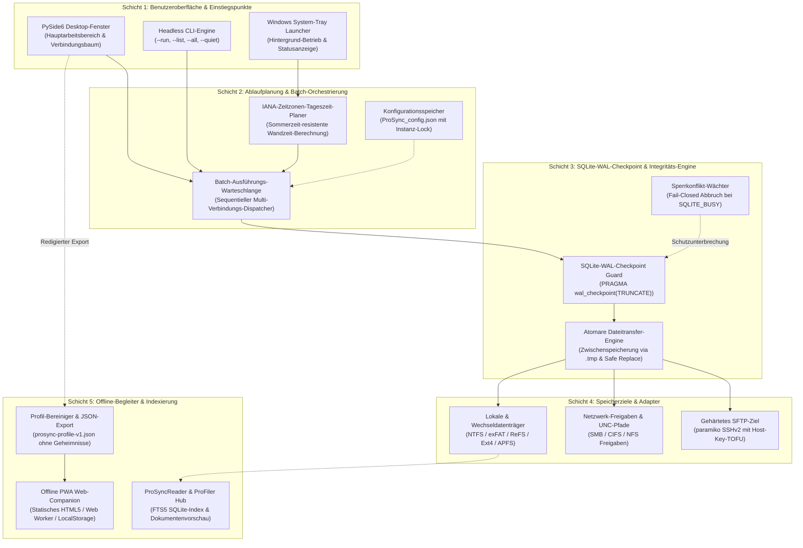
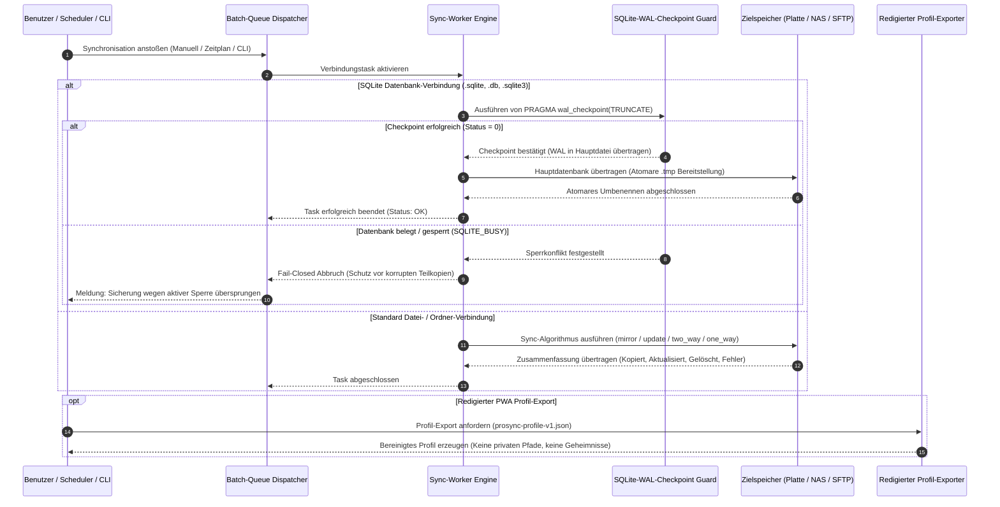

# ProSync

[English](README.md) · [Deutsch](README_de.md) · [Español](README.es.md) · [Benutzerhandbuch](USER_GUIDE.md)

> Intelligente lokale Backup-Synchronisation mit automatischem SQLite-WAL-Datenbankschutz.

[](LICENSE)
[](NOTICE)
[](CHANGELOG.md)
[](#10-installation--abhaengigkeiten)
[](pyproject.toml)
[](#16-tests--qualitaetssicherung)
[](PRIVACY_POLICY.md)
[](SECURITY.md)
[](SECURITY.md)
[](THIRD_PARTY_LICENSES.md)
[](https://github.com/file-bricks)
[](https://github.com/open-bricks)
[](llms.txt)
[](CHANGELOG.md)

> [!NOTE]
> **Abgrenzung / Disambiguation:** `file-bricks/ProSync` ist eine quelloffene Windows-Desktop- und Hintergrundanwendung auf Python-Basis (PySide6) für die lokale Datei- und Ordnersynchronisation mit automatischem SQLite-WAL-Datenbankschutz. Das Projekt steht in keiner Verbindung zu Enterprise-Datenbank-Replikationssoftware (wie z. B. Tibero ProSync) oder macOS-Synchronisationswerkzeugen Dritter.

**Maschinenlesbarer Index:** Spezifikation verfügbar unter [`llms.txt`](llms.txt). Zuletzt geprüft: **2026-09-26**.

---

## Schnelleinstieg

1. [Funktionen & Kernkompetenzen](#1-funktionen)
2. [Systemarchitektur & Datenfluss](#2-architektur)
3. [Zielgruppen & Auffindbarkeit](#3-zielgruppen--auffindbarkeit)
4. [Vergleichsmatrix gegenüber Alternativen](#4-vergleichsmatrix-gegenueber-alternativen)
5. [Duale Mermaid-Diagramme](#5-duale-mermaid-diagramme)
6. [Governance & Laufzeit-Invarianten](#6-governance--laufzeit-invarianten)
7. [Synchronisationsmodi & Semantik](#7-synchronisationsmodi)
8. [SQLite-WAL-Datenbankschutz](#8-sqlite-wal-datenbankschutz)
9. [Visuelle Vorschau & Feature-Galerie](#9-visuelle-vorschau--feature-galerie)
10. [Installation & Abhängigkeiten](#10-installation--abhaengigkeiten)
11. [CLI & Headless-Automatisierung](#11-cli--headless-automatisierung)
12. [Zeitgesteuerte Backups & IANA-Zeitzonen](#12-zeitgesteuerte-backups--iana-zeitzonen)
13. [Portabler Web/PWA-Begleiter](#13-portabler-webpwa-begleiter)
14. [ProSyncReader & ProFiler-Suche](#14-prosyncreader--profiler-suche)
15. [Windows Store & MSIX-Bereitstellung](#15-windows-store--msix-bereitstellung)
16. [Tests & Qualitätssicherung](#16-tests--qualitaetssicherung)
17. [Drittanbieter-Lizenzen & Transparenz](#17-drittanbieter-lizenzen--transparenz)
18. [Sicherheitsrichtlinie & Geschwister-Ökosystem](#18-sicherheitsrichtlinie--geschwister-oekosystem)

---

<a id="1-features"></a>
<a id="features"></a>
<a id="key-features"></a>
<a id="1-funktionen"></a>
<a id="funktionen"></a>
<a id="hauptfunktionen"></a>
## 1. Funktionen & Kernkompetenzen

- **Ordner-Synchronisation:** Flexible Modi (Spiegelung, Aktualisierung, Beidseitig, Einseitig, Nur-Index).
- **Datei-Synchronisation:** Dedizierte Einzeldatei-Sicherungen für geschäftskritische Daten.
- **Automatische Datenbank-Erkennung:** Erkennt SQLite (`.db`, `.sqlite`, `.sqlite3`, `.db3`) und MS Access Datenbanken zuverlässig.
- **WAL-Checkpoint-Schutz:** Führt vor dem Kopieren von aktiven SQLite-Datenbanken automatisch ein `PRAGMA wal_checkpoint(TRUNCATE)` aus und bricht bei Sperren sauber ab (`SQLITE_BUSY`).
- **System-Tray-Integration:** Arbeitet unaufdringlich im Windows-Infobereich mit Autostart und Kontextmenü.
- **Geplante Backups & Tageszeit-Trigger:** Konfigurierbare Zeitintervalle oder explizite IANA-zeitzonenbasierte tägliche Ortszeit über Sommerzeitwechsel hinweg.
- **Batch-Sync-Warteschlange:** Mehrere ausgewählte Verbindungen nacheinander in einem Durchlauf abarbeiten mit granularer Fortschrittsanzeige.
- **Atomare Dateioperationen:** Geschriebene Zwischendateien (`.tmp`) vor dem atomaren Ersetzen verhindern korrupte Zieldateien bei Stromausfall.
- **Datenbank-Indexierung & ProFiler-Companion:** Optionale Volltextsuche und Direktöffnung über den Such-Companion.
- **Portabler Web/PWA-Companion:** Exportiert redigierte `prosync-profile-v1.json` für die Offline-Ansicht im Mobil- oder Desktop-Browser.
- **Cross-Platform bereit:** Standardisierte 8-Punkte-Smoke-Suiten für Linux und macOS.
- **Windows Store Vorbereitung:** Vollständiges MSIX-Packaging, AppxManifest-Deklarationen und Kachel-Assets (Policy 10.1.3 konform).

---

<a id="2-architecture"></a>
<a id="architecture"></a>
<a id="architecture--data-flow"></a>
<a id="2-architektur"></a>
<a id="architektur"></a>
<a id="architektur--datenfluss"></a>
## 2. Systemarchitektur & Datenfluss

ProSync trennt Benutzeroberfläche, Ablaufplanung, Datenbankintegritätsprüfung und Speicheradapter in saubere, entkoppelte Schichten:

```
+---------------------------------------------------------------------------------+
|                                BENUTZEROBERFLÄCHE                               |
|   +------------------------------------+   +--------------------------------+   |
|   | PySide6 Desktop GUI (Hauptfenster) |   | System-Tray Hintergrundwächter |   |
|   +------------------------------------+   +--------------------------------+   |
|   +------------------------------------+   +--------------------------------+   |
|   | Headless CLI (--run / --all)       |   | ProSyncReader Such-Begleiter   |   |
|   +------------------------------------+   +--------------------------------+   |
+---------------------------------------------------------------------------------+
                                         |
                                         v
+---------------------------------------------------------------------------------+
|                       SCHEDULER & BATCH-WARTESCHLANGE                           |
|   ├── IANA-Zeitzonen-Auswertung (DST-sicher) ├── Sequentielle Batch-Queue       |
|   └── Konfigurationsverwaltung               └── Instanz-Lock-Koordination      |
+---------------------------------------------------------------------------------+
                                         |
                                         v
+---------------------------------------------------------------------------------+
|                     SYNC- & INTEGRITÄTS-ENGINE (KERN)                           |
|   ├── SQLite WAL-Checkpoint Guard (PRAGMA wal_checkpoint(TRUNCATE))             |
|   ├── Sperrkonflikt-Wächter (SQLITE_BUSY Fail-Closed Abbruch)                   |
|   ├── Atomare Bereitstellung & Zwischendateien (.tmp Safe Replace)              |
|   └── Modus-Logik: mirror | update | two_way | one_way | index_only             |
+---------------------------------------------------------------------------------+
                                         |
                                         v
+---------------------------------------------------------------------------------+
|                                 SPEICHERZIELE                                   |
|   ├── Lokale Laufwerke (NTFS, exFAT, APFS, Ext4)                                |
|   ├── Netzlaufwerke & Freigaben (NAS / SMB / CIFS UNC-Pfade)                    |
|   └── SFTP-Remote-Endpunkte (Gehärtetes Paramiko mit Host-Key-TOFU)             |
+---------------------------------------------------------------------------------+
```

---

<a id="3-target-personas--discoverability"></a>
<a id="target-personas--discoverability"></a>
<a id="target-personas"></a>
<a id="3-zielgruppen--auffindbarkeit"></a>
<a id="zielgruppen--auffindbarkeit"></a>
<a id="zielgruppen"></a>
## 3. Zielgruppen & Auffindbarkeit

### Zielgruppen-Personas

- **[PERSONA-01] Desktop-Power-User & Windows-Sysadmins:**
  - *Kontext:* Regelmäßige automatisierte Sicherung wichtiger Arbeitsordner, NAS-Freigaben und externer NVMe/USB-Laufwerke.
  - *Schmerzpunkt:* Herkömmliche Sync-Tools laufen selten sauber im Hintergrund-Tray, beherrschen keine zuverlässige Zeitplanung oder beschädigen offene SQLite-Dateien.
  - *Lösungsbeitrag von ProSync:* Unaufdringlicher System-Tray-Betrieb, IANA-zeitzonensichere Tageszeit-Trigger, Batch-Queues und atomare Ordnersynchronisation mit Fail-Closed-Sicherheit.

- **[PERSONA-02] SQLite- & Desktop-Anwendungsentwickler:**
  - *Kontext:* Entwicklungs- und Produktionsumgebungen, die SQLite im WAL-Modus (Write-Ahead Logging) betreiben.
  - *Schmerzpunkt:* Reine Kopierwerkzeuge sichern aktive Datenbanken während ungeschriebener WAL-Transaktionen und erzeugen korrupte, unbrauchbare Backups.
  - *Lösungsbeitrag von ProSync:* Automatisiertes Pre-Sync SQLite-WAL-Checkpointing (`PRAGMA wal_checkpoint(TRUNCATE)`), defensive Erkennung von Sperrkonflikten (Abbruch bei `SQLITE_BUSY`) und Ausschluss von Hilfsdateien (`.db-wal`, `.db-shm`).

- **[PERSONA-03] Datenschutz- & Compliance-Beauftragte / DSGVO-Auditoren:**
  - *Kontext:* Sensible Mandanten-, Patienten- oder Entwicklungsdaten, die strikter Vertraulichkeit unterliegen.
  - *Schmerzpunkt:* Cloud-Sync-Programme und SaaS-Backups übertragen unbemerkt Telemetrie, Metadaten und Analysedaten an fremde Server.
  - *Lösungsbeitrag von ProSync:* Kompromisslose 100% Local-First- & Zero-Egress-Architektur; keinerlei externe Netzwerksockets für Tracking; unprivilegierte Benutzerberechtigung (`RunAsInvoker`).

- **[PERSONA-04] Automatisierungs-Ingenieure & Multi-Agenten-Architekten:**
  - *Kontext:* Headless-Skripte, CI-Validierung, Batch-Abläufe und LLM-gestützte Werkzeugketten.
  - *Schmerzpunkt:* Starre GUI-Programme ohne Scripting-Schnittstelle, die manuelle Klicks erfordern.
  - *Lösungsbeitrag von ProSync:* Vollständiges Headless-CLI (`--list`, `--run <id|name>`, `--all`, `--quiet`), bereinigtes Profil-Exportformat (`prosync-profile-v1.json`) und automatisierte Vertragstestsuiten.

### High-Intent Suchbegriffe

- *"datei synchronisation windows desktop app"*
- *"pyside6 ordner backup synchronisieren"*
- *"sqlite wal datenbank sicherung python"*
- *"lokales backup tool ohne cloud zero egress"*
- *"automatisches backup system tray windows"*
- *"ordner spiegeln aktualisieren offline python"*
- *"datenbank sicherung wal checkpoint konsistent"*
- *"sftp backup synchronisation desktop open source"*
- *"datenschutz backup synchronisation zero egress"*
- *"dateimanager synchronisation file-bricks"*

---

<a id="4-comparative-matrix-vs-alternatives"></a>
<a id="comparative-matrix-vs-alternatives"></a>
<a id="comparative-matrix"></a>
<a id="4-vergleichsmatrix-gegenueber-alternativen"></a>
<a id="vergleichsmatrix-gegenueber-alternativen"></a>
<a id="vergleichsmatrix"></a>
## 4. Vergleichsmatrix gegenüber Alternativen

| Technische Dimension / Invariante | ProSync (`file-bricks`) | FreeFileSync | Robocopy / Rsync | Syncthing | Kommerzielle Cloud-SaaS |
|---|---|---|---|---|---|
| **INV-LOCAL-01 Local-First & Zero-Egress** | **100% Lokal & Offline** | 100% Lokal | 100% Lokal | P2P-Netzwerk | Cloud-Relay / Telemetrie |
| **INV-RUNAS-02 RunAsInvoker Benutzer-Modus** | **Strikte Standardrechte** | Nativer Installer | OS-Standard | User / Daemon | Systemdienst / Elevation |
| **INV-WAL-03 SQLite WAL Checkpoint Schutz** | **Automatisch `PRAGMA wal_checkpoint`** | Keine (Raw Copy) | Keine (Raw Copy) | Keine (File Watcher) | Keine (Sperrfehler) |
| **INV-INTEG-04 Atomare Bereitstellung & Ersatz** | **Staging `.tmp` Safe Replace** | Direkter Stream | Direkter Stream | Temp-Staging | Block-Upload-Staging |
| **INV-SCHED-05 IANA-Zeitzonen-Planung** | **Integrierte IANA-Engine** | Windows Aufgabenplanung | Cron / Task Scheduler | Kontinuierlich | Cloud-Zeitplan |
| **INV-PWA-06 Redigierter Offline-Begleiter** | **Export `prosync-profile-v1.json`** | Keine | Keine | Web-GUI (Localhost) | Web-Portal (Online) |
| **INV-PLAT-07 Plattform-Smoke-Parität** | **Windows, Linux & macOS Matrix** | Windows, macOS, Linux | OS-spezifisch | Go Cross-Platform | Plattform-Apps |
| **INV-STORE-08 Windows Store / MSIX Staging** | **AppxManifest & Policy 10.1.3** | Standalone Setup | Keine | Chocolatey / Scoop | Windows Store App |
| **INV-DOCS-09 1:1 Zweisprachig & LLM-Index** | **18 Punkte DE/EN + `llms.txt`** | Englische Doku | Man-Pages / Doku | Englische Doku | Online-Hilfecenter |
| **INV-SLA-10 Open-Source-Governance & SLA** | **MIT-Lizenz, 48h Response SLA** | GPL v3 | Proprietär / GPL | MPL 2.0 | Proprietär Kommerziell |

---

<a id="5-dual-mermaid-diagrams"></a>
<a id="dual-mermaid-diagrams"></a>
<a id="mermaid-diagrams"></a>
<a id="end-to-end-backup--wal-checkpoint-lifecycle"></a>
<a id="5-duale-mermaid-diagramme"></a>
<a id="duale-mermaid-diagramme"></a>
<a id="mermaid-diagramme"></a>
<a id="end-to-end-backup--wal-checkpoint-lebenszyklus"></a>
## 5. Duale Mermaid-Diagramme

### System-Architektur-Topologie (`flowchart TD`)



### End-to-End Backup & WAL Checkpoint Lebenszyklus (`sequenceDiagram`)



---

<a id="6-governance--runtime-invariants"></a>
<a id="governance--runtime-invariants"></a>
<a id="runtime-invariants"></a>
<a id="6-governance--laufzeit-invarianten"></a>
<a id="governance--laufzeit-invarianten"></a>
<a id="laufzeit-invarianten"></a>
## 6. Governance & Laufzeit-Invarianten

ProSync setzt zehn verbindliche Governance- und Laufzeit-Invarianten durch:

| Invariante | Bezeichnung | Durchsetzung & Beschreibung |
|---|---|---|
| `INV-LOCAL-01` | **Local-First & Zero-Egress** | Reine lokale Laufzeit. Keine Netzwerksockets für Telemetrie oder Analytik. Verifiziert in `tests/test_security_license_contract.py`. |
| `INV-RUNAS-02` | **Unprivilegierter RunAsInvoker** | Arbeitet vollständig im unprivilegierten Standardbenutzer-Modus ohne UAC-Elevation. Dokumentiert in `SECURITY.md` und `pyproject.toml`. |
| `INV-WAL-03` | **SQLite-WAL-Absturzsicherheit** | Automatisiertes `PRAGMA wal_checkpoint(TRUNCATE)` vor dem Kopieren aktiver SQLite-Datenbanken; Fail-Closed Abbruch bei Sperren (`SQLITE_BUSY`). |
| `INV-INTEG-04` | **Atomare Bereitstellung** | Dateischreibvorgänge erfolgen über temporäre Dateien (`.tmp`) vor dem atomaren Ersetzen; Zieldateien bleiben niemals teilgeschrieben zurück. |
| `INV-SCHED-05` | **DST-sichere Tageszeit-Planung** | Integrierte IANA-Zeitzonen-Berechnung berechnet die exakte Wandzeit und verhindert Wiederholungsläufe bei Zeitumstellungen. |
| `INV-PWA-06` | **Redigierter Begleiter-Export** | `prosync-profile-v1.json` entfernt absolute Pfade, Passwörter und Zugangsdaten für die sichere mobile Offline-Ansicht. |
| `INV-PLAT-07` | **Plattform-Smoke-Parität** | Standardisierte 8-Punkte-Smoke-Testsuiten für Linux und macOS prüfen System-Öffner und POSIX-Pfade. |
| `INV-STORE-08` | **Windows Store & MSIX Staging** | Gültiges Desktop-Bridge AppxManifest (`Geiger.ProSync`), Policy 10.1.3 konforme Suchbegriffe und vollständige Kachelsätze. |
| `INV-DOCS-09` | **1:1 Zweisprachige Dokumentation** | Exakte reziproke Schnellnavigations-Parität zwischen Englisch (`README.md`) und Deutsch (`README_de.md`), synchronisiert mit `llms.txt`. |
| `INV-SLA-10` | **Open-Source-Governance & SLA** | Freie MIT-Lizenz, öffentliche Ticket-Triagierung und 48-Stunden Erstkontakt- / 5-Tage Triage-SLA in `SECURITY.md`. |

---

<a id="7-synchronization-modes"></a>
<a id="synchronization-modes"></a>
<a id="sync-modes"></a>
<a id="7-synchronisationsmodi"></a>
<a id="synchronisationsmodi"></a>
<a id="synchronisations-modi"></a>
## 7. Synchronisationsmodi & Semantik

ProSync bietet fünf klar definierte Synchronisationsmodi für unterschiedliche Anforderungen:

| Modus | Semantisches Verhalten | Primärer Einsatzzweck |
|---|---|---|
| **`mirror`** | Ziel wird als exaktes 1:1 Abbild der Quelle geführt (verwaiste Zieldateien werden gelöscht) | Vollständige System- und Projekt-Backups |
| **`update`** | Nur neuere oder fehlende Quelldateien werden übertragen (keine Löschungen im Ziel) | Inkrementelle tägliche Arbeits-Backups |
| **`two_way`** | Beidseitige Synchronisation mit Konfliktauflösung nach neuester Datei | Synchronisation zwischen Laptop und Workstation |
| **`one_way`** | Quelldateien werden ins Ziel kopiert, ohne jemals Zieldateien zu entfernen | Sichere, nicht-destruktive Langzeitarchivierung |
| **`index_only`** | Indexiert Metadaten und Ordnerstrukturen, ohne Dateiinhalte zu kopieren | Vorbereitung für die ProFiler-Suche |

---

<a id="8-sqlite-wal-database-protection"></a>
<a id="sqlite-wal-database-protection"></a>
<a id="database-protection-v32"></a>
<a id="database-safety"></a>
<a id="8-sqlite-wal-datenbankschutz"></a>
<a id="sqlite-wal-datenbankschutz"></a>
<a id="datenbankschutz-v32"></a>
<a id="datenbankschutz"></a>
## 8. SQLite-WAL-Datenbankschutz

ProSync erkennt aktive SQLite-Dateien automatisch und schützt sie vor Inkonsistenzen:

### Unterstützte Datenbankformate
- **SQLite:** `.sqlite`, `.sqlite3`, `.db`, `.db3`
- **MS Access:** `.mdb`, `.accdb`

### Sicherheitsregeln
1. **Automatischer Ausschluss im Ordner-Sync:** Werden Ordner mit aktiven Datenbanken synchronisiert, schließt ProSync Hilfsdateien (`.db-wal`, `.db-shm`, `.db-journal`) automatisch aus.
2. **Dedizierte Dateiverbindungen:** Für aktive Produktivdatenbanken empfiehlt sich eine dedizierte **Dateiverbindung** mit aktiviertem WAL-Checkpoint.
3. **Automatisierter Checkpoint:** Vor dem Kopiervorgang ruft ProSync `PRAGMA wal_checkpoint(TRUNCATE)` auf:
   - **Erfolg (0):** Sämtliche Änderungen im WAL-Journal sind in der Hauptdatei konsolidiert. Diese wird anschließend atomar übertragen.
   - **Sperrkonflikt / Busy:** Hält eine fremde Anwendung eine aktive Schreibsperre, bricht ProSync den Kopiervorgang sofort ab (`SQLITE_BUSY`), um beschädigte Schnappschüsse zu verhindern.

---

<a id="9-visual-showcase--feature-gallery"></a>
<a id="visual-showcase--feature-gallery"></a>
<a id="visual-showcase"></a>
<a id="9-visuelle-vorschau--feature-galerie"></a>
<a id="visuelle-vorschau--feature-galerie"></a>
<a id="visual-showcase--galerie"></a>
## 9. Visuelle Vorschau & Feature-Galerie

| Hauptübersicht & Verbindungsmanager | SQLite-WAL-Datenbankschutz | Portables Profil & PWA-Begleiter |
| :---: | :---: | :---: |
|  |  |  |
| *Multi-Task-Verbindungsmanager mit Zeitplan und Batch-Warteschlange.* | *Automatische WAL-Erkennung und Validierung vor dem Kopiervorgang.* | *Redigierter Profilexport für Offline-Inspektion im mobilen PWA-Reader.* |

---

<a id="10-installation--dependencies"></a>
<a id="installation--dependencies"></a>
<a id="installation"></a>
<a id="10-installation--abhaengigkeiten"></a>
<a id="installation--abhaengigkeiten"></a>
## 10. Installation & Abhängigkeiten

ProSync unterstützt Python 3.10, 3.11 und 3.12 (`>=3.10`).

```bash
pip install -r requirements.txt
```

### Kern-Laufzeitbibliotheken
- `PySide6 >= 6.5.0` (GUI & Infobereich-Steuerung)
- `paramiko >= 3.4.0` (Gehärteter SFTP-Netzwerktrennungs-Transport)
- `tzdata >= 2025.2` (IANA-Zeitzonendatenbank für Windows-Planung)
- `pypdf >= 4.0.0` (Reine Python-Dokumentenvorschau in ProSyncReader)
- `(Optional) python-docx` (Word-Dokumentenvorschau)

---

<a id="11-cli--headless-automation"></a>
<a id="cli--headless-automation"></a>
<a id="headless-cli"></a>
<a id="usage"></a>
<a id="11-cli--headless-automatisierung"></a>
<a id="cli--headless-automatisierung"></a>
<a id="verwendung"></a>
## 11. CLI & Headless-Automatisierung

ProSync verfügt über eine vollständige Befehlszeilenschnittstelle für Hintergrundaufgaben und Skripte:

```bash
# Alle konfigurierten Verbindungen auflisten
python ProSyncStart_V3.1.py --list

# Bestimmte Verbindung anhand der ID oder des Namens ausführen
python ProSyncStart_V3.1.py --run "Tägliche Projektspiegelung"

# Alle aktivierten Verbindungen sequentiell abarbeiten
python ProSyncStart_V3.1.py --all

# Ruhiger Modus für unbeaufsichtigte Automatisierung
python ProSyncStart_V3.1.py --all --quiet --config pfad/zur/config.json
```

---

<a id="12-scheduled-backups--iana-timezones"></a>
<a id="scheduled-backups--iana-timezones"></a>
<a id="scheduled-backups"></a>
<a id="12-zeitgesteuerte-backups--iana-zeitzonen"></a>
<a id="zeitgesteuerte-backups--iana-zeitzonen"></a>
<a id="zeitgesteuerte-backups"></a>
## 12. Zeitgesteuerte Backups & IANA-Zeitzonen

ProSync bietet zwei zuverlässige Auslösemodi:
1. **Intervall-Timer:** Wiederholt alle `N` Minuten oder Stunden im Hintergrund-Tray.
2. **Tägliche Ortszeit:** Startet zu einer festgelegten Uhrzeit (z. B. `18:00`). Durch den Einsatz von `zoneinfo` und `tzdata` werden Sommerzeitumstellungen präzise abgebildet.

---

<a id="13-portable-webpwa-companion"></a>
<a id="portable-webpwa-companion"></a>
<a id="webpwa-companion"></a>
<a id="portable-web-companion-export"></a>
<a id="13-portabler-webpwa-begleiter"></a>
<a id="portabler-webpwa-begleiter"></a>
<a id="web-companion"></a>
<a id="portabler-web-companion-export"></a>
## 13. Portabler Web/PWA-Begleiter

Über den Dialog **`⇄ Profil austauschen`** exportiert ProSync ein bereinigtes Profil (`prosync-profile-v1.json`). Der Web-Reader in `web_companion/` gestattet die Offline-Einsicht:
- Vollständig offlinefähig dank HTML5 und Service Worker.
- Keine Geheimnisse: Lokale Quell- und Zielpfade sowie Passwörter werden vor dem Export entfernt.
- Mobile Nutzung über lokalen HTTP-Server:

```bash
cd web_companion
python -m http.server 4179
```

---

<a id="14-prosyncreader--profiler-search"></a>
<a id="prosyncreader--profiler-search"></a>
<a id="prosyncreader--profiler-companion"></a>
<a id="14-prosyncreader--profiler-suche"></a>
<a id="prosyncreader--profiler-suche"></a>
<a id="prosyncreader--profiler-begleiter"></a>
## 14. ProSyncReader & ProFiler-Suche

ProSync arbeitet nahtlos mit der Begleitanwendung **ProFiler** (`ProSyncReader.py`) zusammen:
- Volltextsuche in synchronisierten Datenbeständen und SQLite-Indexen.
- Vorschau von PDF- und Textdokumenten.
- Direkte Startmöglichkeit aus dem Hauptfenster von ProSync.

```bash
python ProSyncReader.py
```

---

<a id="15-windows-store--msix-staging"></a>
<a id="windows-store--msix-staging"></a>
<a id="windows-build"></a>
<a id="15-windows-store--msix-bereitstellung"></a>
<a id="windows-store--msix-bereitstellung"></a>
<a id="windows-build-de"></a>
## 15. Windows Store & MSIX-Bereitstellung

ProSync verfügt über vollständige Microsoft Store / MSIX Bereitstellungsunterlagen:
- **AppxManifest:** Abgelegt unter `store_package/ProSync/AppxManifest.xml` mit Identität `Geiger.ProSync`.
- **Policy 10.1.3 Konformität:** Streng limitierte Schlüsselwörter (maximal 7 hochrelevante Begriffe).
- **Automatisierte Validierung:**
  ```bash
  python scripts/check_store_readiness.py
  ```
- **Lokaler Windows-Build:** `build_exe.bat` erzeugt eigenständige Executables für Windows.

---

<a id="16-testing--quality-checks"></a>
<a id="testing--quality-checks"></a>
<a id="quality-checks"></a>
<a id="16-tests--qualitaetssicherung"></a>
<a id="tests--qualitaetssicherung"></a>
<a id="qualitaetssicherung"></a>
## 16. Tests & Qualitätssicherung

Stand **2026-09-18**: 124 Python-Tests und 29 Web/PWA-Tests bestanden (153 Gesamt-Tests).

```bash
# Syntax- und Kompilierprüfung der Kernmodule
python -m compileall -q ProSyncStart_V3.1.py ProSyncReader.py prosync_utils.py schedule_time.py logger.py run_tests.py

# Gesamte Pytest-Suite ausführen
python -m pytest -ra -v

# Lokalen Test-Runner ausführen
python run_tests.py

# Linting mit Ruff
python -m ruff check .

# Web-Companion Tests prüfen
cd web_companion
npm test
node --check app.js
node --check library.js
node --check sw.js
```

---

<a id="17-third-party-licenses--transparency"></a>
<a id="third-party-licenses--transparency"></a>
<a id="license"></a>
<a id="17-drittanbieter-lizenzen--transparenz"></a>
<a id="drittanbieter-lizenzen--transparenz"></a>
<a id="lizenz"></a>
## 17. Drittanbieter-Lizenzen & Transparenz

ProSync steht unter der freien [MIT-Lizenz](LICENSE).

- **Dynamische Verlinkung:** PySide6 (LGPL-3.0) und Paramiko (LGPL-2.1) werden als eigenständige Python-Räder dynamisch eingebunden. In Binärversionen verbleiben Qt-Bibliotheken als separate DLLs gemäß LGPL-3.0 Abschnitt 4.
- **Unprivilegierter Modus (`RunAsInvoker`):** Die Software benötigt keinerlei Administrator- oder Root-Rechte.
- **Detaillierte Lizenzübersicht:** Siehe [THIRD_PARTY_LICENSES.md](THIRD_PARTY_LICENSES.md) und [THIRD_PARTY_LICENSES.txt](THIRD_PARTY_LICENSES.txt) für vollständige SPDX-Kennungen und Urheberhinweise.

---

<a id="18-security-policy--sibling-ecosystem"></a>
<a id="security-policy--sibling-ecosystem"></a>
<a id="sibling-tools--file-bricks-ecosystem"></a>
<a id="sibling-tools"></a>
<a id="privacy-and-local-files"></a>
<a id="18-sicherheitsrichtlinie--geschwister-oekosystem"></a>
<a id="sicherheitsrichtlinie--geschwister-oekosystem"></a>
<a id="geschwister-werkzeuge--file-bricks-okosystem"></a>
<a id="datenschutz-und-lokale-dateien"></a>
## 18. Sicherheitsrichtlinie & Geschwister-Ökosystem

ProSync wird von **file-bricks** im Rahmen der **open-bricks** Initiative gepflegt. Sicherheitsmeldungen nimmt unser Team gemäß [SECURITY.md](SECURITY.md) entgegen (48-Stunden Reaktionszeit).

### Rechtlicher Hinweis (§ 521 BGB Gefälligkeitsrecht)
> [!NOTE]
> Die Software wird unentgeltlich nach den Regeln des Rechts der Gefälligkeit (§ 521 BGB) zur Verfügung gestellt. Der Urheber haftet ausschließlich für Vorsatz und grobe Fahrlässigkeit. Jegliche weitergehende Gewährleistung oder Haftung für Datenverlust oder mittelbare Schäden ist im gesetzlich zulässigen Rahmen ausgeschlossen.

### Geschwister-Ökosystem-Matrix

| Repository | Org | Beschreibung | Schwerpunkt |
| :--- | :--- | :--- | :--- |
| **[ProSync](https://github.com/file-bricks/ProSync)** | `file-bricks` | Intelligente Backup-Synchronisation & SQLite-WAL-Schutz | Backup & Datenbankschutz |
| **[ExplorerPro](https://github.com/file-bricks/ExplorerPro)** | `file-bricks` | Datei-Manager mit Multi-Tab-Oberfläche und FTS5-Suche | Dateiverwaltung |
| **[CloudLockFixer](https://github.com/file-bricks/CloudLockFixer)** | `file-bricks` | Löst Cloud-Sperren und repariert Offline-Caches | Cloud-Sync-Hygiene |
| **[ProFiler](https://github.com/file-bricks/ProFiler)** | `file-bricks` | Tiefenindexierung und Metadaten-Katalogisierung | Dateiindexierung & Suche |
| **[NoteSpaceLLM](https://github.com/file-bricks/NoteSpaceLLM)** | `file-bricks` | Lokale Notizverwaltung mit KI-Erweiterung | Wissensmanagement |
| **[WinStorePackager](https://github.com/file-bricks/WinStorePackager)** | `file-bricks` | Werkzeugkette für Windows Store MSIX-Pakete | Store-Packaging |
| **[UniversalDocsGrabber](https://github.com/doc-bricks/UniversalDocsGrabber)** | `doc-bricks` | Dokumentenerfassung, OCR und redigierter Reader | Dokumentenverarbeitung |
| **[MediaBrain](https://github.com/doc-bricks/MediaBrain)** | `doc-bricks` | Medienkatalogisierung und Asset-Indexierung | Medienverwaltung |
| **[CleanMarkdown](https://github.com/doc-bricks/CleanMarkdown)** | `doc-bricks` | Markdown-Bereinigung, Link-Prüfung und Linter | Text-Hygiene |
| **[ellmos-filecommander-mcp](https://github.com/ellmos-ai/ellmos-filecommander-mcp)** | `ellmos-ai` | Lokaler 47-Tool MCP-Server für Dateioperationen | Agenten-Werkzeuge |
| **[lock-master](https://github.com/ellmos-ai/lock-master)** | `ellmos-ai` | Verteilte Agenten-Sperren & Dateikoordination | Agenten-Parallelität |
| **[WikiStub-Seed](https://github.com/dev-bricks/WikiStub-Seed)** | `dev-bricks` | Automatisierte Dokumentations- und Stub-Erstellung | Entwickler-Werkzeuge |
| **[open-bricks](https://github.com/open-bricks)** | `open-bricks` | Dachorganisation für datenschutzkonforme Open-Source-Tools | Open-Source-Dach |
