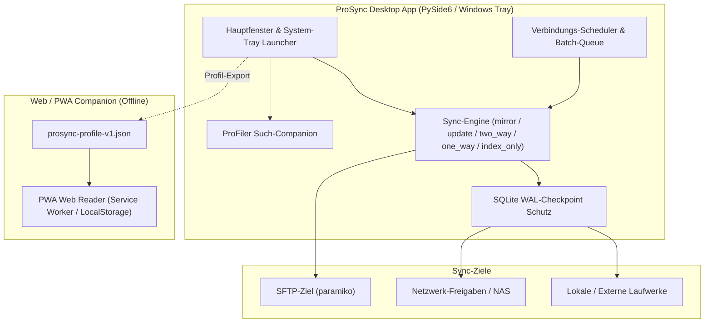
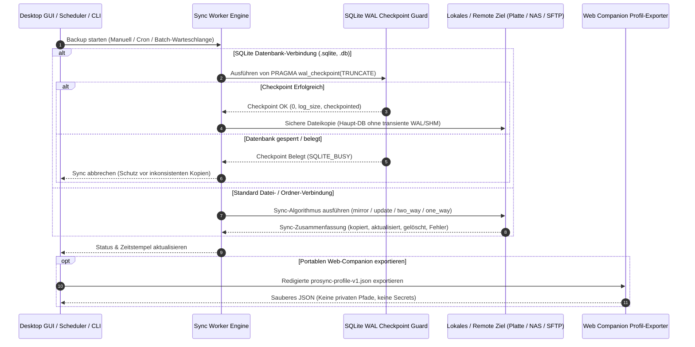

# ProSync

**[🇬🇧 English Documentation](README.md)** · **🇩🇪 Deutsch**

> Intelligente lokale Backup-Synchronisation mit automatischem SQLite-WAL-Datenbankschutz.

[](LICENSE)
[](CHANGELOG.md)
[](#installation)
[](pyproject.toml)
[](#qualitatssicherung)
[](PRIVACY_POLICY.md)
[](SECURITY.md)
[](https://github.com/file-bricks)
[](https://github.com/open-bricks)
[](llms.txt)

> [!NOTE]
> **Abgrenzung / Disambiguation:** `file-bricks/ProSync` ist eine quelloffene Windows-Desktop- und Hintergrundanwendung auf Python-Basis (PySide6) für die lokale Datei- und Ordnersynchronisation mit automatischem SQLite-WAL-Datenbankschutz. Das Projekt steht in keiner Verbindung zu Enterprise-Datenbank-Replikationssoftware (wie z. B. Tibero ProSync) oder macOS-Synchronisationswerkzeugen Dritter.

**Schnelleinstieg:** [Features](#features) · [Architektur](#architektur--datenfluss) · [Ablaufdiagramm](#end-to-end-backup--wal-checkpoint-lebenszyklus) · [Visual Showcase](#visual-showcase--galerie) · [Installation](#installation) · [CLI-Verwendung](#headless-cli) · [Sync-Modi](#synchronisations-modi) · [Datenbankschutz](#datenbankschutz-v32) · [Web-Companion](#webpwa-companion) · [Geschwisterwerkzeuge](#geschwister-werkzeuge--file-bricks-okosystem) · [Sicherheitsrichtlinie](SECURITY.md) · [Benutzerhandbuch](USER_GUIDE.md) · [Changelog](CHANGELOG.md) · [LLM-Kontext](llms.txt)

---

## Features

- **Ordner-Synchronisation:** Flexible Modi (Spiegelung, Aktualisierung, Beidseitig, Einseitig, Nur-Index).
- **Datei-Synchronisation:** Dedizierte Einzeldatei-Sicherungen für geschäftskritische Daten.
- **Automatische Datenbank-Erkennung:** Erkennt SQLite (`.db`, `.sqlite`, `.sqlite3`, `.db3`) und MS Access Datenbanken zuverlässig.
- **WAL-Checkpoint-Schutz:** Führt vor dem Kopieren von aktiven SQLite-Datenbanken automatisch ein `PRAGMA wal_checkpoint(TRUNCATE)` aus und bricht bei Sperren sauber ab.
- **System-Tray-Integration:** Arbeitet unaufdringlich im Windows-Infobereich mit Autostart und Kontextmenü.
- **Geplante Backups & Tageszeit-Trigger:** Konfigurierbare Zeitintervalle oder explizite IANA-zeitzonenbasierte tägliche Ortszeit.
- **Batch-Sync-Warteschlange:** Mehrere ausgewählte Verbindungen nacheinander in einem Durchlauf abarbeiten.
- **Datenbank-Indexierung & ProFiler-Companion:** Optionale Volltextsuche und Direktöffnung über den Such-Companion.
- **Portabler Web/PWA-Companion:** Exportiert redigierte `prosync-profile-v1.json` für die Offline-Ansicht im Mobil- oder Desktop-Browser.
- **Cross-Platform bereit:** Standardisierte 8-Punkte-Smoke-Suiten für Linux und macOS.
- **Windows Store Vorbereitung:** Vollständiges MSIX-Packaging, AppxManifest-Deklarationen und Kachel-Assets (Policy 10.1.3 konform).

---

## Architektur & Datenfluss



---

## End-to-End Backup & WAL Checkpoint Lebenszyklus



---

## Visual Showcase & Galerie

| Hauptübersicht & Verbindungsmanager | SQLite WAL Datenbankschutz | Portabler Profil-Export & PWA |
| :---: | :---: | :---: |
|  |  |  |
| *Multi-Task-Verbindungsmanager mit Zeitplanung und Batch-Warteschlange.* | *Automatische SQLite-WAL-Erkennung und Vorab-Checkpoint-Prüfung.* | *Redigierter Profil-Export für Offline-Inspektion und mobilen PWA-Reader.* |

---

## Installation

Unterstützt werden Python 3.10 bis 3.12 (`>=3.10`).

```bash
pip install -r requirements.txt
```

### Erforderliche Pakete

- `PySide6` (Desktop-GUI & System-Tray)
- `paramiko` (SFTP-Netzwerkziel-Unterstützung)
- `pypdf` (Dokumentenvorschau im Reader)
- `tzdata` (IANA-Zeitzonendatenbank für den täglichen Scheduler)
- `(Optional) python-docx` für Word-Dokumentenvorschau im Reader

---

## Verwendung

### Via Python

```bash
python ProSyncStart_V3.1.py
```

### Headless-CLI

```bash
python ProSyncStart_V3.1.py --list
python ProSyncStart_V3.1.py --run "Verbindungs-ID oder exakter Name"
python ProSyncStart_V3.1.py --all
```

Für Automationen kann mit `--config <pfad-zu-ProSync_config.json>` eine eigene Konfigurationsdatei gewählt werden. `--quiet` unterdrückt Statuszeilen für geplante Läufe. Der CLI-Sync verwendet dieselben Datei- und Ordner-Worker wie die GUI und bricht ab, wenn bereits eine andere ProSync-Instanz den Laufzeit-Lock hält.

### Via Batch-Datei

```bash
START.bat
```

Die Anwendung startet im System Tray. Rechtsklick auf das Icon für Optionen.

---

## Windows-Build

Für einen reproduzierbaren lokalen Windows-Build steht `build_exe.bat` bereit. Das Skript erzeugt `dist/ProSync/ProSync.exe` und kopiert `ProSyncReader.exe` in denselben Ausgabeordner, damit die Suchoberfläche auch im Frozen-Modus weiterhin separat gestartet werden kann. Build-Artefakte in `build/`, `dist/` und `releases/` werden bewusst nicht versioniert.

---

## Synchronisations-Modi

| Modus | Beschreibung | Anwendungsfall |
|-------|--------------|----------------|
| **mirror** | Ziel = exakte Kopie der Quelle | Vollständiges Backup |
| **update** | Nur neuere Dateien übertragen | Inkrementelles Backup |
| **two_way** | Beidseitige Synchronisation | Sync zwischen zwei Arbeitsplätzen |
| **one_way** | Quelle → Ziel, keine Löschungen | Sichere Archivierung |
| **index_only** | Nur Indexierung, kein Kopieren | Dateiverwaltung ohne Datenbewegung |

---

## Beispielszenarien

### 1. Projektordner-Sicherung

**Aufgabe:** Tägliches Backup eines Entwicklungsprojekts
- **Quelle:** `C:\Projekte\MeinProjekt`
- **Ziel:** `D:\Backups\MeinProjekt`
- **Modus:** `mirror`
- **Zeitplan:** Täglich um 18:00 Uhr
- **Indexierung:** Aktiviert (für Suche)
- **Ergebnis:** Vollständige Sicherung mit Dateiversionierung und Suchfunktion

### 2. Synchronisation zwischen Laptop und Desktop

**Aufgabe:** Dateien zwischen zwei PCs synchron halten
- **Quelle:** `C:\Dokumente`
- **Ziel:** `\\Desktop-PC\Dokumente`
- **Modus:** `two_way`
- **Zeitplan:** Alle 30 Minuten
- **Konfliktlösung:** `newest` (neueste Datei gewinnt)
- **Ergebnis:** Beidseitiger Abgleich, beide PCs haben stets den aktuellen Stand

### 3. Datenbank-Sicherung (SQLite im WAL-Modus)

**Aufgabe:** Sichere Sicherung einer aktiven SQLite-Datenbank
- **Typ:** Datei-Verbindung (kein Ordner!)
- **Quelle:** `C:\App\data.db`
- **Ziel:** `D:\Backups\data.db`
- **Modus:** `one_way`
- **WAL-Checkpoint:** Aktiviert
- **Zeitplan:** Alle 4 Stunden
- **Ergebnis:** Konsistente DB-Backups ohne Beschädigungsrisiko

---

## Datenbankschutz (V3.2)

ProSync erkennt kritische Datenbanken automatisch und wendet sichere Einstellungen an:

### Unterstützte Datenbanktypen

- **SQLite** (.sqlite, .sqlite3, .db, .db3)
- **MS Access** (.mdb, .accdb)

### Automatische Schutzmaßnahmen

#### Bei Ordner-Verbindungen:
- Kritische DBs (im WAL-Modus) werden **automatisch ausgeschlossen**
- WAL-Dateien (`.db-wal`, `.db-shm`, `.db-journal`) werden **niemals kopiert**
- Empfehlung: Legen Sie **Datei-Verbindungen** für einzelne DBs an

#### Bei Datei-Verbindungen:
- **WAL-Checkpoint** ist automatisch aktiviert
- **One-Way-Modus** wird empfohlen
- Checkpoint wird vor jedem Kopiervorgang ausgeführt

### Was ist ein WAL-Checkpoint?

WAL (Write-Ahead Logging) speichert SQLite-Änderungen in einer separaten `-wal`-Datei. Ein Checkpoint überträgt diese Änderungen zurück in die Haupt-DB-Datei.

- **Ohne Checkpoint:** Inkonsistente oder unvollständige Backups möglich!
- **Mit Checkpoint:** ProSync kopiert die Datenbank erst nach erfolgreichem Checkpoint; ein fehlerhafter oder blockierter Checkpoint bricht den Sync sicher ab.

---

## Konfigurationsdatei

`ProSync_config.json` wird lokal automatisch erstellt und verwaltet. Die Datei wird von Git ignoriert, da sie persönliche Pfade enthalten kann. Ein sicheres Muster liegt als `ProSync_config.example.json` bei.

---

## ProSyncReader & ProFiler-Companion

Ein separates Werkzeug zum Durchsuchen der synchronisierten Datenbanken:

```bash
python ProSyncReader.py
```

- Volltextsuche in synchronisierten Dateien
- Schlagwortbasierte Tag-Suche
- Dateivorschau (PDF, DOCX)
- Direktes Öffnen von Dateien und Ordnern

ProSync kann ProFiler direkt aus dem Hauptfenster starten. Konfigurierte Pfade können absolut oder relativ angegeben werden.

---

## Portabler Web-Companion Export

Der Desktop-Client kann über **`⇄ Profil austauschen`** eine `prosync-profile-v1.json` exportieren. Der Web/PWA-Companion verarbeitet exakt dieses redigierte Format rein lesend:

- Keine realen Quell-, Ziel- oder Datenbankpfade
- Keine Passwörter, Tokens oder internen Pfade
- Keine browserbasierte Ausführung
- Kein unautorisierter Cloud-Zugriff

```bash
cd web_companion
python -m http.server 4179
```

---

## Geschwister-Werkzeuge & file-bricks Ökosystem

ProSync ist Teil des modularen **file-bricks** und **open-bricks** Desktop-Ökosystems:

| Repository | Org | Beschreibung | Schwerpunkt |
| :--- | :--- | :--- | :--- |
| **[ProSync](https://github.com/file-bricks/ProSync)** | `file-bricks` | Intelligente Backup-Synchronisation & SQLite WAL-Datenbankschutz | Backup & Datensicherheit |
| **[ExplorerPro](https://github.com/file-bricks/ExplorerPro)** | `file-bricks` | Multi-Tab Datei-Explorer & visuelle Arbeitsbereich-Strukturierung | Dateiverwaltung |
| **[CloudLockFixer](https://github.com/file-bricks/CloudLockFixer)** | `file-bricks` | Cloud-Lock Resolver, Offline-Cache Prüfer & Dateifreigabe | Cloud-Sync Hygiene |
| **[ProFiler](https://github.com/file-bricks/ProFiler)** | `file-bricks` | Dateiverzeichnis-Indexierung, Metadaten-Tagging & Such-Companion | Indexierung & Suche |
| **[NoteSpaceLLM](https://github.com/file-bricks/NoteSpaceLLM)** | `file-bricks` | Lokaler Desktop-Notizen-Arbeitsplatz mit KI-Erweiterungen | Lokale Wissensverwaltung |
| **[WinStorePackager](https://github.com/file-bricks/WinStorePackager)** | `file-bricks` | Automatisierte MSIX- und Windows-Store Paketierungs-Toolchain | App-Store Tooling |
| **[UniversalDocsGrabber](https://github.com/doc-bricks/UniversalDocsGrabber)** | `doc-bricks` | Dokumenten-Erfassung, Textextraktion, OCR & redigierter PWA-Reader | Dokumentenverarbeitung |
| **[MediaBrain](https://github.com/doc-bricks/MediaBrain)** | `doc-bricks` | Medien-Katalogisierung und automatisiertes Asset-Indexing | Medienverwaltung |
| **[CleanMarkdown](https://github.com/doc-bricks/CleanMarkdown)** | `doc-bricks` | Markdown-Bereinigung, Link-Validierung und Typografie-Linter | Dokumentenhygiene |
| **[ellmos-filecommander-mcp](https://github.com/ellmos-ai/ellmos-filecommander-mcp)** | `ellmos-ai` | Local-First 47-Tool MCP-Server für Datei- und Suchoperationen | Agenten-Werkzeuge |
| **[lock-master](https://github.com/ellmos-ai/lock-master)** | `ellmos-ai` | Verteilte Dateisperren-Koordination & Lock-Arbitrierung | Agenten-Koordination |
| **[WikiStub-Seed](https://github.com/dev-bricks/WikiStub-Seed)** | `dev-bricks` | Automatisierter Dokumentations- und mehrsprachiger Stub-Generator | Entwickler-Tools |
| **[open-bricks](https://github.com/open-bricks)** | `open-bricks` | Dachorganisation für datenschutzfreundliche Open-Source-Software | Open-Source-Dach |

---

## Qualitätssicherung

Zuletzt verifiziert am 2026-08-22: 99 Python-Tests und 29 Web-/PWA-Tests bestanden (128 Tests gesamt).

```bash
python -m compileall -q ProSyncStart_V3.1.py ProSyncReader.py prosync_utils.py schedule_time.py logger.py run_tests.py
python run_tests.py
python -m pytest -q
```

Web-Companion Verifikation:

```bash
cd web_companion
npm test
node --check app.js
node --check library.js
node --check sw.js
```

---

## Datenschutz und Lokale Dateien

`ProSync_config.json`, Logs, Build-Artefakte und lokale Notizen bleiben außerhalb des Repositories. Das getrackte `ProSync_config.example.json` enthält ausschließlich eine leere Beispielstruktur ohne persönliche Quell- oder Zielpfade.

Das GitHub-Repository trackt ausschließlich Quellcode, Tests, Musterkonfigurationen und Dokumentation. Lokale Sync-Ziele, Datenbanken, WAL-Dateien, temporäre Locks und Build-Ausgaben sind über `.gitignore` ausgeschlossen. Siehe [PRIVACY_POLICY.md](PRIVACY_POLICY.md) für vollständige Datenschutzgarantien, [SECURITY.md](SECURITY.md) für Sicherheitsrichtlinien und [SUPPORT.md](SUPPORT.md) für Support-Anfragen.

Details zur Microsoft Store Paketierung und Offline-First-Konformität finden sich in [WINDOWS_STORE_PREP.md](WINDOWS_STORE_PREP.md).

---

## System-Tray-Befehle

- **Linksklick:** Hauptfenster öffnen
- **Rechtsklick → Ausführen:** Verbindung manuell starten
- **Rechtsklick → Auto-Run:** Geplante Synchronisation aktivieren
- **Rechtsklick → Beenden:** ProSync schließen

---

## Lizenz

MIT - Siehe [LICENSE](LICENSE)

Dieses Projekt verwendet PySide6 (LGPL).
